

<form id="configform" style="display: none;">
  <fieldset id="configbox">
    <legend>Configuration:</legend>
    <label><input type="checkbox" name="pegasus" id="pegasus"> Pegasus</label> 
      

        <label><input type="checkbox" name="forceexodus" id="forceexodus"> Variant: use "extra card" style Loyalty deck from Exodus</label>
      

    <label><input type="checkbox" name="exodus" id="exodus"> Exodus</label> 
      

        <label><input type="checkbox" name="personalgoal" id="personalgoal"> Personal Goal cards</label> 
        <label><input type="checkbox" name="finalfive" id="finalfive"> Final Five cards</label> 
        <label><input type="checkbox" name="cylonfleet" id="cylonfleet"> Cylon Fleet board</label> 
        <label><input type="checkbox" name="allyseasons" id="allyseasons"> Variant: Allies for All Seasons</label> 
        <label><input type="checkbox" name="forcepegasus" id="forcepegasus"> Variant: use regular Loyalty Deck instead of "extra card"</label>
      

    <label><input type="checkbox" name="daybreak" id="daybreak"> Daybreak</label> 
      

        <label><input type="checkbox" name="forcedemetrius" id="forcedemetrius"> Variant: use the Demetrius board & Mission cards regardless of ending</label>
      

    <label><input type="checkbox" name="cylonleader" id="cylonleader"> Cylon Leader chosen</label> 
    <label>Ending:
      <select id="ending">
        <option value="kobol" id="kobol" selected>Kobol</option>
        <option value="newcaprica" id="newcaprica">New Caprica</option>
        <option value="ioniannebula" id="ioniannebula">Ionian Nebula</option>
        <option value="searchforhome" id="searchforhome">Search for Home (Earth)</option>
        <option value="allendings" id="allendings">Variant: Show rules for ALL endings</option>
      </select>
    </label>
    

    <label><input type="checkbox" name="nosympathizer" id="nosympathizer"> Use official "No Sympathizer" variant</label> 
    <label><input type="checkbox" name="sympatheticcylon" id="sympatheticcylon"> Variant: Use official "Sympathetic Cylon" variant without Pegasus</label> 
    <label><input type="checkbox" name="forceoverlay" id="forceoverlay"> Variant: Use a Cylon Locations overlay</label> 
    <label><input type="checkbox" name="forcemotive" id="forcemotive"> Variant: Replace Agenda cards with Motives from Daybreak</label> 
    <label><input type="checkbox" name="variants" id="variants"> Show other official game variants</label> 
    <label><input type="checkbox" name="help" id="help"> Show help</label> 
    <label><input type="checkbox" name="highlight" id="highlight"> Highlight modified rules</label> 
    

    <label>Share this configuration: 
      <input style="width: 100%;" type="text" id="generatedUrl" name="generatedUrl" />
    </label>
  </fieldset>
</form>

<form id="preconfigform" class="preconfigured" style="display: none;">
  <fieldset id="preconfigbox">
    <legend>Configuration:</legend>
    
This link was pre-configured. <a href="{{ site.baseurl}}rulebook.html">
    Click here to go back to the configurable rulebook.</a>

    

    This configuration includes:

    <ul>
      <li class="pegasus"> Pegasus
        <ul> 
          <li>Pegasus expansion</li>
          <li class="forceexodus">Variant: use "extra card" style Loyalty deck from Exodus</li>
        </ul>
      </li>
      <li class="exodus"> Exodus
        <ul>
          <li>Exodus expansion</li>
          <li class="personalgoal"> Personal Goal cards</li>
          <li class="finalfive"> Final Five cards</li>
          <li class="cylonfleet"> Cylon Fleet board</li>
          <li class="allyseasons"> Variant: Allies for All Seasons</li>
          <li class="forcepegasus"> Variant: use regular Loyalty Deck instead of "extra card"</li>
        </ul>
      </li>
      <li class="daybreak"> Daybreak
        <ul>
          <li>Daybreak expansion</li>
          <li class="forcedemetrius"> Variant: use the Demetrius board & Mission cards regardless of ending</li>
        </ul>
      </li>
      <li class="cylonleader"> Cylon Leader chosen</li>
      <li class="nosympathizer"> Official "No Sympathizer" variant</li>
      <li class="sympatheticcylon"> Variant: Use official "Sympathetic Cylon" variant without Pegasus</li>
      <li class="forceoverlay"> Variant: Use a Cylon Locations overlay</li>
      <li class="forcemotive"> Variant: Replace Agenda cards with Motives from Daybreak</li>
      <li class="variants"> Show other official game variants</li>
      <li class="help"> Show help</li>
      <li class="highlight"> Highlight modified rules</li>
      <li>Ending:
        <ul>
          <li class="kobol">Kobol</li>
          <li class="newcaprica">New Caprica</li>
          <li class="ioniannebula">Ionian Nebula</li>
          <li class="searchforhome">Search for Home (Earth)</li>
          <li class="allendings">Variant: Show rules for ALL endings</li>
        </ul>
      </li>
    </ul> 
  </fieldset>
</form>

<form id="nojsform" class="nojs">
  <fieldset id="preconfigbox">
    <legend>Configuration:</legend>
    
JavaScript is either not enabled or not working. The rules for 
    including every expansion, with no variants enabled, will
    be shown instead, along with the rules for each possible ending. 

  </fieldset>
</form>

## Help

Use the checkboxes and menus above to select a configuration of Battlestar Galactica expansions, modules, and variants. Some items might be disabled if they conflict with another selected option. 

### All endings

Many variants exist that add *all* the endings to the game. None of them are included here, but you can still use this rulebook for such a game by selecting "all endings". This will show all of the official rules for every ending. Whichever variant you are using will tell you how to proceed through all the endings, but when you need to resolve "normal" gameplay events and issues they will be available.

### Agendas and Motives

Pegasus and Daybreak both added Cylon Leaders, but the way that Cylon Leaders win is different in Daybreak. You can choose to "backport" Motive cards to the Pegasus elements that use Agenda cards (Cylon Leaders and Sympathetic Cylon). The reverse (using Agenda cards in Daybreak for Cylon Leaders) isn't integrated into the rules, because Agenda cards are very simple and don't have any rule conflicts. All you have to do is:

- Give the Cylon Leader a Hostile (for a 5 or 7 player game) or Sympathetic (4 or 6 player game) Agenda card when the first round of Loyalty cards goes out.
- Ignore any mention of Motive cards in the rules. 
- Use the text of the Agenda card to determine whether the Cylon Leader wins or loses at the end of the game. 

### Sympathizer variants

The "Sympathizer" role from the base game is intended to be a sort of "half-Cylon": if the game is going well for the humans, a new Cylon is added (with some restrictions), but if not, a human player is merely sent to the Brig. 

This card proved to be rather unpopular for a few reasons. For one, the unlucky player who becomes a Cylon via the Sympathizer card is immediately revealed as a Cylon and doesn't get to secretly sabotage the humans, and even as a Cylon they do not get a Super Crisis and cannot use the Cylon Fleet location, removing over a quarter of their possible Cylon actions. Secondly, it adds an incentive for the humans to sabotage themselves before the Sleeper Agent phase so that the Sympathizer stays human. 

There are a few options for avoiding the Sympathizer. Daybreak and Pegasus add Cylon Leaders, special characters who are almost literally half-Cylons and therefore remove the need for a Sympathizer when they are used. Pegasus adds the option of using the "Sympathetic Cylon" Loyalty card, which is very similar to the Sympathizer but instead changes a player into essentially a Cylon Leader. As a variant, you can even choose to just use the Sympathetic Cylon without the rest of Pegasus. 

Daybreak replaces both the "Sympathizer" and "Sympathetic Cylon" with "The Mutineer", a player who gets lots of Mutiny cards, so no variant is necessary to avoid the Sympathizer using this expansion. 

The simplest option, however, requiring no expansions at all, is the "No Sympathizer" variant which was officially released by Fantasy Flight Games. It just handicaps the humans and allows Cylons to draw more cards. 

### Allies for All Seasons

This variant was designed by Alexander DeSouza. It allows the "Ally" mechanic to be added to a game without having to use the entire Ionian Nebula ending. 

### Loyalty deck variants

The Loyalty deck variants have to do with the Exodus "extra card" rule change. In Pegasus, an executed human player always comes back as a human. This is a little unfortunate from a story perspective: the humans can perform a rather gruesome, but guaranteed, Cylon test for a relatively small cost. Exodus changes this, and always leaves an extra Loyalty card in the deck. This has two effects: an executed human may come back as a Cylon, but a Cylon card might remain in the deck, never dealt to a player at all. 

Both have their pros and cons. The Pegasus version has the advantage that the game is never short a Cylon. The Exodus version has more intrigue, and avoids giving the humans a perverse incentive to kill their own teammates. The Exodus version starts to make even more sense when Personal Goal and Final Five cards are included, because even if an executed human comes back as a human, they may be stuck with one of these human-hostile cards. The Pegasus version starts to make more sense with fewer players, since it becomes more likely that the remaining card will be a Cylon. 

Some game mechanics depend on the Exodus version, like Personal Goal cards and some Ally cards. When those are enabled, you will be forced to use the Exodus style. Otherwise, you can choose whichever one you like best: guaranteed Cylons but also an easy test, or more uncertainty and the possibility of a missing Cylon. You could also pick one, but add an additional rule to mitigate the downsides. Some examples include:

- Exodus rules, then at distance 7, all human players roll the die. The lowest receives the final Loyalty card, guaranteeing that the last Cylon gets out at some point.
- Pegasus rules, but a new human character must draw from a special deck that is half “Personal Goal”/”Final Five” cards, half normal “Not A Cylon” cards. They’ll still be a guaranteed human, but dealing with the special Loyalty card can penalize the humans for killing an innocent.
- Exodus rules, then at the end of the game, if the remaining card was a Cylon, deduct 1 from each resource as a handicap before declaring a human victory.



<i>Jump to...</i> <ol><li><a href="#introduction">Introduction</a></li><li><a href="#the-basics">The basics</a><ol><li><a href="#strategy">Strategy</a></li></ol></li><li><a href="#game-setup">Game setup</a><ol><li><a href="#game-board">Game board</a></li><li><a href="#pegasus">Pegasus</a></li><li><a href="#exodus">Exodus</a></li><li><a href="#daybreak">Daybreak</a></li><li><a href="#kobol-ending">Kobol ending</a></li><li><a href="#new-caprica-ending">New Caprica ending</a></li><li><a href="#ionian-nebula-ending">Ionian Nebula ending</a></li><li><a href="#search-for-home-ending">Search for Home ending</a></li><li><a href="#choosing-characters">Choosing characters</a></li><li><a href="#loyalty-deck">Loyalty Deck</a></li><li><a href="#first-hand-of-cards">First hand of cards</a></li><li><a href="#ionian-nebula-additional-setup">Ionian Nebula additional setup</a></li><li><a href="#rule-reminders">Rule reminders</a></li></ol></li><li><a href="#playing-the-game">Playing The Game</a><ol><li><a href="#game-turn">Game turn</a></li><li><a href="#player-terminology">Player terminology</a></li><li><a href="#secrecy">Secrecy</a></li><li><a href="#resolving-rule-conflicts">Resolving rule conflicts</a></li><li><a href="#component-limitations">Component limitations</a></li><li><a href="#die-rolls">Die rolls</a></li><li><a href="#timing">Timing</a></li><li><a href="#resources">Resources</a></li><li><a href="#trauma-tokens">Trauma Tokens</a><ol><li><a href="#trauma-tokens-on-locations">Trauma tokens on locations</a></li></ol></li><li><a href="#ally-cards">Ally cards</a><ol><li><a href="#placing-a-new-ally">Placing a new Ally</a></li><li><a href="#ally-replaced-with-player-or-location-damaged">Ally replaced with player, or location damaged</a></li></ol></li><li><a href="#demetrius--missions">Demetrius &amp; Missions</a></li><li><a href="#rebel-basestar-human-or-cylon">Rebel Basestar (human or Cylon)</a></li><li><a href="#character-sheets">Character sheets</a></li><li><a href="#once-per-game">Once per game</a></li><li><a href="#loyalty-cards">Loyalty cards</a><ol><li><a href="#personal-goal-cards">Personal Goal cards</a></li><li><a href="#final-five-cards">Final Five cards</a></li><li><a href="#the-mutineer">The Mutineer</a></li></ol></li><li><a href="#mutiny-cards">Mutiny cards</a><ol><li><a href="#drawing-a-second-mutiny-card">Drawing a second Mutiny card</a></li><li><a href="#discarding-treachery-cards-and-gaining-mutiny-cards">Discarding Treachery cards and gaining Mutiny cards</a></li></ol></li><li><a href="#cylon-players">Cylon Players</a><ol><li><a href="#cylon-reveal-resolution">Cylon Reveal resolution</a></li></ol></li><li><a href="#titles">Titles</a><ol><li><a href="#president">President</a></li><li><a href="#admiral">Admiral</a></li><li><a href="#cag-commander-air-group">CAG (Commander, Air Group)</a></li></ol></li><li><a href="#lines-of-succession">Lines of Succession</a></li><li><a href="#actions--abilities">Actions &amp; Abilities</a><ol><li><a href="#movement-actions">Movement actions</a></li></ol></li><li><a href="#moves">Moves</a><ol><li><a href="#sabotage-treachery-card-interrupt">“Sabotage” Treachery card interrupt</a></li><li><a href="#moves-versus-movement-actions">Moves versus Movement actions</a></li></ol></li><li><a href="#skill-cards">Skill Cards</a><ol><li><a href="#skill-check-abilities">Skill Check Abilities</a></li><li><a href="#reckless-cards-and-abilities">Reckless cards and abilities</a></li><li><a href="#types">Types</a></li><li><a href="#destiny-deck">Destiny Deck</a></li></ol></li><li><a href="#crisis-card-resolution">Crisis card resolution</a></li><li><a href="#event-crisis-cards">Event Crisis cards</a></li><li><a href="#super-crisis-cards">Super Crisis Cards</a></li><li><a href="#skill-check-resolution">Skill Check resolution</a></li><li><a href="#activating-cylon-ships">Activating Cylon ships</a><ol><li><a href="#activating-a-raider">Activating a raider</a></li><li><a href="#activating-heavy-raiders-and-centurions">Activating heavy raiders and Centurions</a></li></ol></li><li><a href="#jumping-the-fleet">Jumping the fleet</a></li><li><a href="#sleeper-agent-phase">Sleeper Agent phase</a><ol><li><a href="#revealed-cylons-during-the-sleeper-agent-phase">Revealed Cylons during the Sleeper Agent phase</a></li></ol></li><li><a href="#combat-ship-attack-table">Combat ship attack table</a><ol><li><a href="#basestar-damage">Basestar damage</a></li><li><a href="#damaging-galactica">Damaging Galactica</a></li><li><a href="#damaging-pegasus">Damaging Pegasus</a></li><li><a href="#scar">Scar</a></li></ol></li><li><a href="#human-combat-ships">Human combat ships</a><ol><li><a href="#civilian-ships">Civilian ships</a><ol><li><a href="#drawing-and-destroying">Drawing and destroying</a></li></ol></li><li><a href="#raptors">Raptors</a></li><li><a href="#vipers">Vipers</a></li><li><a href="#mark-vii-vipers">Mark VII Vipers</a></li><li><a href="#assault-raptors">Assault raptors</a></li><li><a href="#piloting">Piloting</a></li></ol></li><li><a href="#execution">Execution</a><ol><li><a href="#finishing-a-cylon-execution">Finishing a Cylon execution</a></li><li><a href="#finishing-a-human-execution">Finishing a human execution</a></li></ol></li><li><a href="#character-ability-notes">Character ability notes</a></li><li><a href="#location-notes">Location notes</a><ol><li><a href="#commmand">Commmand</a></li><li><a href="#the-brig">The Brig</a></li><li><a href="#choosing-players-for-sickbaybrig">Choosing players for Sickbay/Brig</a></li><li><a href="#colonial-one">Colonial One</a></li><li><a href="#cylon-fleet-location">Cylon Fleet location</a></li><li><a href="#basestar-bridge">Basestar Bridge</a></li></ol></li></ol></li><li><a href="#ending-the-game">Ending the game</a><ol><li><a href="#new-caprica-phase">New Caprica phase</a><ol><li><a href="#new-caprica-phase-setup">New Caprica phase setup</a></li><li><a href="#new-caprica-phase-rules">New Caprica phase rules</a><ol><li><a href="#occupation-forces">Occupation Forces</a></li><li><a href="#preparing-civilian-ships">Preparing civilian ships</a></li><li><a href="#brig-versus-detention">Brig versus Detention</a></li></ol></li><li><a href="#before-galactica-returns">Before Galactica returns</a></li><li><a href="#after-galactica-returns">After Galactica returns</a></li><li><a href="#evacuating-new-caprica">Evacuating New Caprica</a></li></ol></li><li><a href="#ionian-nebula-crossroads-phase">Ionian Nebula: Crossroads Phase</a><ol><li><a href="#battle-of-the-ionian-nebula">Battle of the Ionian Nebula</a></li><li><a href="#crossroads">Crossroads</a></li><li><a href="#the-trialboxing-the-line">The Trial/Boxing the Line</a></li><li><a href="#elimination">Elimination</a></li></ol></li><li><a href="#human-loss">Human loss</a></li><li><a href="#final-jump">Final jump</a></li></ol></li></ol>

## Introduction

This rulebook is intended to be a single resource for the official rules of [Battlestar Galactica by Fantasy Flight Games](https://www.fantasyflightgames.com/en/products/battlestar-galactica/), including its 3 expansions. The goals are for it to be complete and unambiguous, incorporating the published rules included with the games as well as clarifications and rulings made later, so that no one has to dig through 4 rulebooks, errata, official FAQs, [unofficial FAQs](https://boardgamegeek.com/wiki/page/Battlestar_Galactica_FAQ), and rulings by FFG employees in response to customer questions. 

For beginning players, it's probably best to use the official base game rulebook to learn the game. This rulebook has lots of detail, even when all the expansions are turned off, which is probably going to hurt more than help. But if you are playing the game and have a question that the official rulebook doesn't seem to answer, take a look. An experienced player should be able to use this to teach new players the game, since they can explain the basics themselves and know what details can be ignored to start. 

Configure which expansions and options are being included by using the form at the top of the page. Some rules change based on which expansions or options are included, and the rulebook will change as you configure it. 

By default, this rulebook sticks to the official rules and rulings by Fantasy Flight Games. However, some options are available for variants, including one by Alexander DeSouza called "Allies for All Seasons" which pulls in the "ally" mechanic without the rest of the Ionian Nebula ending. 

## The basics

Humanity has been decimated in a surprise attack by the Cylons, a race of machines who were created by humans and rebelled against them. After 40 years of peace, the remaining members of the human race are suddenly on the run, fleeing through space and fighting for survival. In the escape, however, it becomes clear that the Cylons have evolved -- there are models that are completely indistinguishable from humans, and some don't even *know* that they are Cylons.

During the game, the human fleet will attempt to escape the pursuing Cylons, moving toward the final objective in a series of faster-than-light jumps. The humans have re-formed their government and what's left of the military still follows a chain of command... but can those in authority be trusted?

Each player will select a character and be dealt Loyalty cards. Characters have different skills and abilities, and a well-balanced team of players will help the humans succeed and survive. Players take turns, where they can draw cards, move, and take an action, but at the end of each turn all players must deal with a crisis. It could be a surprise Cylon attack, or a dilemma with no clear answer. All this time, some players are secretly Cylons, or may become Cylons partway through the game, so trust is a critical factor. A hidden Cylon could choose to sabotage at a critical moment, or cause infighting amongst the humans. Cylons can also choose to reveal themselves, causing damage along the way and allowing the Cylon to openly fight the humans. 

### Strategy

As a "real" human, you will want to focus on conserving the fleet's resources so that you can survive to the end of the game (which you'll want to bring about as soon as possible). Different characters have different strengths, so players will want to help out in the areas that they are able to. The biggest threat to the humans is hidden Cylons, who could strike at a critical moment. Keep an eye on negative Skill cards, and carefully consider when other players make questionable decisions whether they are being honest. If another player is a Cylon, it's very important to get them thrown in the Brig as soon as possible. While in the Brig, a Cylon doesn't harm the fleet when they reveal themselves, and they'll only be able to put 1 card into Skill checks so they won't be able to hurt too much. At the same time, remember that you may *become* a Cylon during the Sleeper Agent phase... it might turn out that you don't want to help your team out *too* much. 

As a Cylon, you do not want to give away the fact that you are a Cylon until the right moment. Pretend to be a human just like everyone else, but try to find reasons and excuses for not helping out. A negative card or two could set the humans back, but be careful that it does not also point back to you. If you're the only pilot, and suddenly pilot cards start hurting the humans, you'll immediately be the top suspect. Try to make *other* players look like the suspicious ones instead. Players in leadership roles often have to make tough decisions with no right answer, so take opportunities to criticize them and call them into question. Getting thrown in the Brig is a setback because you won't get to add more than 1 card to Skill checks, and you won't get to do damage when you reveal yourself. 

A properly timed reveal could be devastating to the humans, especially if your reveal power is just what the humans *don't* need. You can also go rogue without using your reveal power, openly harming the humans by wasting resources, making harmful decisions, and generally sabotaging the fleet. This is especially useful when you hold a position of power, or if you see an opportunity to do more harm through regular actions. Of course, the humans will quickly catch on and take you down, but they'll have to spend turns and resources to do that. 

After revealing, focus on the humans' weakest point and attack it. Go after the lowest resources as much as possible. Crisis cards usually lower morale, and civilian ships usually contain population. You can also give heavy raiders and centurions a boost, making them even more of a threat and forcing the humans to take care of them quickly. When drawing cards, piloting and engineering are usually negative for Skill checks, but of course Treachery cards are the most useful of all.

## Official variants

These come from the "optional rules" for the base game. They were written before the expansions came out, so they might not address newer game mechanics. 

### Two player game

Both players choose any character they want, except "Boomer". Do not create a Loyalty deck during setup. Instead, during the Sleeper Agent phase, create a Loyalty deck of:

- 1 "You Are a Cylon" card
- 2 "Not a Cylon" cards
- 1 more "Not a Cylon" card for each resource that is in the red

Shuffle and deal 1 card to each player. 

### One player game

To set up, choose a character that is not "Boomer" and not Laura Roslin. This is your main character. Then choose another character as an "assist character". Build a Loyalty deck of 1 "You Are a Cylon", 6 "Not a Cylon" cards and deal 3 to the assist character. As the main character, you receive all the title cards. Start with 1 nuke instead of 2. 

Ignore all negative character abilities in this variant. 

The assist character does not get placed on the board, draw cards, take actions, or hold any titles. While playing the game, you may treat the assist character's once-per-game ability as if it were on your own character sheet. When receiving Skill cards, 1 is allowed to come from the assist character's Skill set (with a maximum of 5 total Skill cards). 

At the end of the "Activate Cylon Ships" step, if heavy raiders were activated during that step, reveal 1 of the assist character's Loyalty cards. If it is a Cylon card, resolve it and remove the assist character from the game. You can no longer use their Skill set or once-per-game ability. The "Can Damage Galactica" Loyalty card is instead resolved as "draw and resolve 2 Galactica damage tokens". The character that is targeted is always the main character. 

Always shuffle the assist character's Loyalty cards after they receive new ones, and after you look at any of them.

While in the Brig, movement is restricted as normal, but you still draw a Crisis card, and you may play up to 3 cards into a Skill check. 

You are allowed to choose yourself when playing Quorum cards that specify to choose "another" player. This does not apply to Skill cards, including "Executive Order". 

At the Sleeper Agent phase, add a "Not a Cylon" card to the Loyalty deck for each resource in the red. Then deal 4 Loyalty cards to the assist character and shuffle their cards. 

### Fully cooperative game

These rules in particular do not account for any of the expansions. There are probably many other cards and game mechanics that do not apply to a Cylon-free game. 

In this variant, there are no hidden Cylons. Do not build a Loyalty deck. The Admiral starts with just 1 nuke. Remove "Encourage Mutiny", "Release Cylon Mugshots", "Assign Arbitrator", and "Arrest Order" from the Quorum deck. Start with 8 fuel, 7 food, 9 morale, and 10 population. 

Each character must draw 1 less Skill card during the "Receive Skills" step. They may choose which card is not drawn.

Characters in the Brig still draw Crisis cards. 

## Game setup

### Game board
Setting up the game board is fairly straightforward. The resource dials are set to their defaults, skill cards go next to their respective spaces on the bottom, vipers and raptors go in the reserves, and the fleet marker goes on the jump track. All other components and decks are placed somewhere near the board for use later. The Skill card discard piles are face-up next to *each* Skill draw pile. 

When an expansion includes a "fancy" version of an existing component, such as the plastic basestars and Centurions, they are used *instead of* those components, not *along with*. The number of components is important, because they are [not treated as unlimited resources](#component-limitations). 

Even though the Daybreak expansion isn't being used in this game, if you have it, it can be useful to use Miracle tokens to track who has and has not used their once-per-game ability. 

The starting layout of ships is:

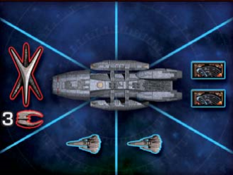

- One basestar and 3 raiders in front of Galactica (left space area)
- Two vipers below Galactica (one in each space area with the launch tube icon)
- Two civilian ships behind Galactica (right space area). 

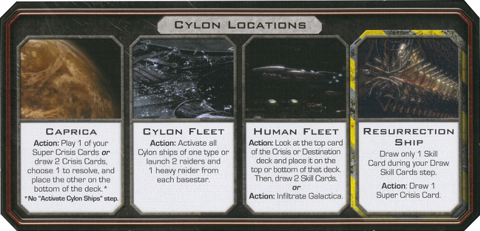

One or more variants is turned on which requires a Cylon Locations overlay. Take one from either Pegasus or Daybreak, and cover the normal Cylon Locations with the overlay, with the side that says "Cylon Locations" face up. 

### Pegasus

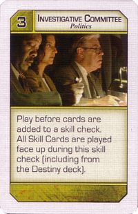

To add the Pegasus expansion, first remove the existing "Investigative Committee" cards from the base game's Politics deck. Pegasus includes a new set of "Investigative Committee" cards that *don't* show the Destiny deck's cards. 

Put the Battlestar Pegasus board to the right of the main board so that the space for the Treachery skill card deck lines up with the other Skill card decks. Put the "Cylon Locations" overlay on top of the main board's Cylon Locations.Do not use the Pegasus "Cylon Locations" overlay, the Daybreak one will be used instead.

Next, add these components from the Pegasus expansion:

- The new character sheets and tokens
- The Battlestar Pegasus game board and Pegasus damage tokens
- New Skill Cards (including "Reckless" Treachery cards)(but do not add the Treachery cards, the ones from Daybreak will be used instead)
- New Crisis, Destination, Quorum, Super Crisis Cards, and Loyalty cards
- The "Scar" token, which denotes a special raider

These rules are configured for play *without* a Cylon leader. 

### Exodus

Add the following components from Exodus:

- New character sheets and tokens
- New Crisis, Quorum, Super Crisis, Skill, and Destination cards. Do not add Crisis and Super Crisis cards that say "CAG Chooses" on them. 
- One additional nuke token next to the board. The Admiral still only receives 2 to start, but now humans may earn more through game effects. 

In addition, follow these steps to set up the Cylon Fleet module:

- Remove all Cylon attack cards from the Crisis and Super Crisis decks. Also remove the "Mining Asteroid" Destination, if present (since it uses the "Scar" Cylon attack card). 
- Make sure that all Crisis and Super Crisis cards from Exodus were added, including those that say "CAG Chooses".
- Place the Cylon Fleet board to the left of the main board, with the Cylon Pursuit marker on the "Start" space.
- Remove 2 regular vipers from the game, and place the 4 Mark VII vipers in the "Damaged Vipers" box. 
- Add the 4 additional Cylon raiders to the stock of Cylon raiders, for a total of 20. 
- Add the CAG title card with the other title cards for distribution later.
- Replace the Admiral title card with the alternate version from Exodus. It changes how nukes work. This Admiral card is used together with the New Caprica Admiral card.

### Daybreak

To add the Daybreak expansion:

- Place the Colonial One overlay over Colonial One, and the Cylon Locations overlay over the Cylon Locations. This Cylon Locations overlay is the one with "Hub Destroyed" on the back. Make sure that "Colonial One Destroyed" and "Hub Destroyed" are face down. 
- Place one assault raptor in the Reserves, and the rest next to the game board with the other ships. 
- Shuffle the Mutiny deck and place it next to the board.
- Add the new character sheets and tokens.
- Add in the new Skill cards, including the "Mutiny" Treachery cards, which are a new type. Note that the Daybreak and Pegasus Treachery cards are *not* intended to be mixed. When playing both expansions, use the Daybreak Treachery cards and remove the Pegasus Treachery cards from the game. 
- Give each player 1 miracle token. 

Place the Demetrius board to the left of the main game board and leave room for the Rebel Basestar board, which may be set up later as the result of a Mission. The Mission deck is shuffled and placed near Demetrius. 

To play with Cylon Leaders, also add the Cylon Leader sheets and tokens. The Cylon leader will also need the "Infiltrator" card and Agenda cards from PegasusMotive cards from Daybreak.

### Kobol ending

The Kobol ending does not require any additional setup. Give the Kobol objective card to the Admiral and follow its instructions when the indicated distances are reached or exceeded.

### New Caprica ending

To play with the New Caprica ending, give the "New Caprica" objective card to the Admiral and follow the instructions on it at the indicated distances. 

The New Caprica President and Admiral title cards add new information that will be used in the New Caprica phase, so they are to be used instead of the regular title cards.Use the New Caprica President and Admiral title cards instead of the regular versions. The Admiral should take both alternate Admiral cards: one adds a new action for the New Caprica phase, and the other changes the way nukes work. Both of these changes apply in this game.

Have the New Caprica game board, New Caprica Crisis deck, and Occupation Force tokens ready for when the New Caprica phase begins, but it doesn't need to be set up until then. 

### Ionian Nebula ending

Follow these instructions to set up the Ionian Nebula ending:

- Give the Admiral the Ionian Nebula objective card. Follow its instructions at the indicated distances. 
- Replace the regular basestar damage tokens with the larger, rectangular damage tokens. Remove the old damage tokens from the game.
- Place the trauma tokens facedown and randomize them. 
- Shuffle and set aside the Crossroads Cards. 
- Shuffle the Ally cards and put the Ally tokens next to the board. 

There are more setup instructions for Ionian Nebula after players choose their characters. 

### Search for Home ending

To set up the Search for Home, give the "Earth" Objective card to the Admiral and follow its instructions when the indicated distances are reached. 

Place the Demetrius board to the left of the main game board and leave room for the Rebel Basestar board, which may be set up later as the result of a Mission. The Mission deck is shuffled and placed near Demetrius. 

### Choosing characters

Determine a first player randomly. They will choose their character first and take the first turn. Both character choice and gameplay will proceed clockwise from there. 

Only 1 player is allowed to choose a Cylon Leader. Cylon Leaders cannot be chosen in a 3 player game.

If there are 4 or 6 players, the official rules for the "No Sympathizer" variant do not allow players to choose Sharon "Boomer" Valerii. The reason is that her weakness is designed to make her more likely to be the Sympathizer, and also in a 6 player game there aren't enough Loyalty cards to accommodate both her and Gaius Baltar's weaknesses. You can choose to ignore this, however, and if an extra Loyalty card is needed, you can just use the "Sympathizer" card and treat it like a normal "Not a Cylon" card.

Players may not choose "alternate" versions of characters that have already been chosen. Note that "Boomer" and "Athena" are *not* alternates of each other, they are separate characters that may both be chosen in the same game. 

Each character has a category: Political, Military, Pilot, and Support. Support characters may be chosen at any time. The other 3 categories must be chosen evenly. For example, if the first two characters chosen were Political and Military, players may not choose another Political or Military character until a Pilot has been selected. 

Once all characters are chosen, distribute titles to the highest in the [lines of succession](#lines-of-succession). 

### Loyalty Deck

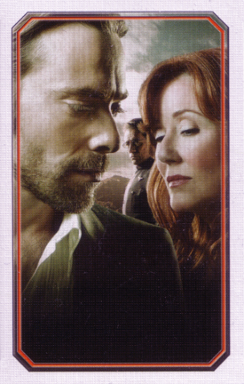

First, build two decks of Loyalty cards: the "You Are a Cylon" and the "You Are Not a Cylon" decks. Set aside any Loyalty cards that have titles other than these two. 

Next, add the Final Five and Personal Goal cards to the "Not a Cylon" deck.Next, add the Personal Goal cards to the "Not a Cylon" deck.

These instructions assume that **one player is playing a Cylon Leader****no one is playing as a Cylon Leader**. If this is not the case, <a href="javascript:toggleCL()">click this link</a> or go to the top of the page and change the Cylon Leader option.

Shuffle both decks separately, then form the initial Loyalty deck according to this table:

| Players |  Cylon cards | Not a Cylon cards | 
| ------- | ------------ | ----------------- |
|    3    |      1       |         5         | 
|    4    |      1       |         6         | 
|    5    |      2       |         8         | 
|    6    |      2       |         9         | 

| Players |  Cylon cards | Not a Cylon cards | 
| ------- | ------------ | ----------------- |
|    4    |      1       |         5         | 
|    5    |      1       |         7         | 
|    6    |      2       |         8         | 
|    7    |      2       |        10         | 

| Players |  Cylon cards | Not a Cylon cards | 
| ------- | ------------ | ----------------- |
|    3    |      1       |         6         | 
|    4    |      1       |         7         | 
|    5    |      2       |         9         | 
|    6    |      2       |         10        | 

| Players |  Cylon cards | Not a Cylon cards | 
| ------- | ------------ | ----------------- |
|    4    |      1       |         6         | 
|    5    |      1       |         8         | 
|    6    |      2       |         9         | 
|    7    |      2       |        11         | 

If no one is playing as a Cylon Leader:

| Players |  Cylon cards | Not a Cylon cards | 
| ------- | ------------ | ----------------- |
|    3    |      1       |         6         | 
|    4    |      1       |         7         | 
|    5    |      2       |         9         | 
|    6    |      2       |         10        | 

If a player is a Cylon Leader:

| Players |  Cylon cards | Not a Cylon cards | 
| ------- | ------------ | ----------------- |
|    4    |      1       |         6         | 
|    5    |      1       |         8         | 
|    6    |      2       |         9         | 
|    7    |      2       |        11         | 

If a player chose Sharon "Boomer" Valerii (Pilot), add 1 more "Not a Cylon" card. 

If a player chose Gaius Baltar (Political), add 1 more "Not a Cylon" card. 

If playing with 5 or 7 total players, add The Mutineer card to the Loyalty deck.

If playing with 4 or 6 total players, add The Mutineer card and 1 more "Not a Cylon" card to the Loyalty deck. 

If playing with 4 or 6 players, get the "You Are a Sympathetic Cylon" card, the "Sympathetic Agenda" cards (they have Caprica Six on the back), the deck of Motive cards,  and the "Infiltration" card, but don't add anything to the Loyalty Deck yet. Set the "Sympathetic Cylon" card aside to be added to the Loyalty deck after the first round of Loyalty cards go out. 

If playing with 4 or 6 players, the "No Sympathizer" variant rules will apply to this game. Set the resource dials to 8 fuel, 7 food, 9 morale, and 10 population, and set aside 1 more "Not a Cylon" card to be added the Loyalty deck after the first round of Loyalty cards is dealt. **Revealed Cylons will draw 3 cards instead of 2 during the game.**

If playing with 4 or 6 players, get the "You Are a Sympathizer" card, and set it aside. Don't add it to the Loyalty deck yet. It is added to the Loyalty deck *after* the first round of cards go out. 

The Motive deck needs to have some cards removed for this variant. Find and remove the "Make an Ally" and "Fight with Honor" cards from the game before any are dealt out. (They refer to Mutiny cards and Treachery cards, respectively, both of which are not in this game.)

The Motive deck needs to have some cards removed for this variant. Find and remove the "Make an Ally" card from the game. (It refers to Mutiny cards, which aren't in this game.) To balance out the deck, find all 7 cards with Cylon allegiance and remove 1 at random from the game. 

Keep the "Not a Cylon" deck, taking care to keep it separate from the actual Loyalty deck. It might be used later to add more cards to the Loyalty deck. The unused cards from the "Cylon" deck are now removed from the game without revealing them. 

The Loyalty deck is now complete. Shuffle it and distribute 1 card to every player except for the Cylon Leader. As per his weakness, Gaius Baltar (Political) receives 2 Loyalty cards instead of 1. After the first round is dealt, add any cards that were set aside to be added later, like the Sympathizer or Sympathetic Cylon.

In a 4 or 6 player game, give the Cylon Leader a random Agenda card from the Sympathetic Agenda deck. (This deck has Caprica Six on the back.) In a 5 or 7 player game, give the Cylon Leader a random Agenda card from the Hostile Agenda deck. (This deck has a Centurion on the back.)

Deal the Cylon Leader two random Motive cards. 

### First hand of cards

Every player *except* the first player draws 3 Skill cards to start the game. (As always, when a player is drawing Skill cards they must come from within their skill set unless otherwise specified.) The first player will get to draw their normal hand of cards in the first turn. A Cylon Leader draws 2 cards instead of 3 unless they begin the game as an Infiltrator. 

Assemble the Destiny deck by taking 2 of each Skill card type and shuffling it. Whenever the Destiny deck runs out, make a new one in the same way. 

### Ionian Nebula additional setup

To finish setting up for a game with the Ionian Nebula ending:

- Place 1 Trauma token in the Brig, and 1 in Sickbay. Do not look at or reveal either one. 
- Each player draws 3 trauma tokens, keeping them hidden. If a player draws "Disaster", the one that looks like a splatter of blood, they reveal it to everyone, replace it with a new token, then shuffle "Disaster" back into the pool. 
- Draw and place Ally cards and their respective tokens until 3 are placed on the board. If an Ally is a duplicate of an existing player's character, remove it from the game and re-draw. Place a Trauma token from the pool face down on each of the 3 Ally cards. 

### Allies for All Seasons additional setup

Designed by Alexander DeSouza, these rules allow you to incorporate Ally cards and tokens without the rest of the Ionian Nebula endgame. 

To setup for Allies for All Seasons, just before starting the game:

- Remove all “disaster” tokens from the game (the ones that show a blood splatter). The remaining Trauma tokens should be randomized facedown into a pile near the board. 
- Draw and place Ally cards and their respective tokens until 3 are placed on the board. If an Ally is a duplicate of an existing player's character, remove it from the game and re-draw. 
- Each player draws 4 Trauma tokens, and contributes 1 to create the Mood Pool.

Human players want the overall Mood to be benevolent, but also want their own tokens to be benevolent toward the end of the game. Cylons are the exact opposite: they want an antagonistic mood, as well as antagonistic tokens for themselves. 

During the game, any player who is sent to the Brig or Sickbay must also draw a Trauma token. A hidden Cylon who is executed must also draw a Trauma token. 

At distance 8, in addition to whatever the objective card says, [resolve the Trauma phase.](#trauma-phase)

### Rule reminders

Before starting the game, check that:

<ul>
  <li>The main board was set up with a basestar, 3 raiders, 2 vipers, and 2 civilian ships.</li>
  <li>Each player except the first player drew 3 Skill cards.</li>
  <li class="treachery">2 Treachery cards were included in the Destiny deck. </li>
  <li class="pegasus daybreak">The Pegasus Treachery cards are <em>not</em> being used, just the Daybreak ones.</li>
  <li class="exodus">The Loyalty deck is separate from the "Not a Cylon" deck, and you know which is which!</li>
  <li class="cylonfleet">All of the Cylon Attack cards have been removed from the Crisis and Super Crisis decks, as well as the "Mining Asteroid" destination.</li>
</ul>

It might be a good idea to remind all players of the following:

<ul>
  <li class="nosympathizer"><strong>If there are 4 or 6 players, revealed Cylons may draw 3 cards at the start of their turn instead of 2.</strong></li>
  <li>When choosing a character to send to Sickbay or the Brig, you must choose someone who can actually be moved there if possible.</li>
  <li>Cylon players can choose to ignore effects on Crisis cards.</li>
  <li>Centurions don't "push" each other on the Boarding Party track, more than one can occupy the same space.</li>
  <li>Even if a resource reaches zero, the humans have until the end of the current player's turn to raise it back up before they lose.</li>
  <li>All players must discard down to 10 Skill cards at the end of each turn if they have more.</li>
  <li>Revealed Cylons should <em>never</em> reveal any more Loyalty cards, even if they say to "immediately reveal this card". They can hand them off later in the Resurrection Ship.</li>
  <li>Super Crisis cards are immune to character abilities and any ability that says it affects Crisis cards.</li>
</ul>

In this variant, when a Cylon is revealed, they show <em>one</em> Cylon Loyalty card and then pass the rest of theirs face down to the human player of their choice when the distance is 6 or less. In addition, the "Caprica" location has changed: the jump icon is no longer ignored when playing a Crisis card.

For these expansions, these are some of the important new rules in effect:

<ul>
  <li class="overlay">When a Cylon is revealed, they show <em>one</em> Cylon Loyalty card and pass the rest of theirs face down to the human player of their choice when the distance is 6 or less.</li>
  <li class="treachery">The text on Treachery cards can only be used by Cylon players.</li>
  <li class="pegasus">"Movement:" actions are actions that can be taken instead of moving <em>during the movement step of your turn</em>.</li>
  <li class="pegasus">When Galactica is damaged, the current player may choose to damage Pegasus instead.</li>
  <li class="exodus">When nukes are used, they are discarded rather than removed from the game. The Admiral still starts with only 2 nukes, but they can now be regained (and there's a possible third nuke token).</li>
  <li class="cylonfleet"><a href="#activating-cylon-ships">The rules for activating Cylon ships are different</a> with the Cylon Fleet board.</li>
  <li class="cylonfleet">Civilian ships are <em>not</em> removed from the board after a jump, and all Cylon ships move to the Cylon Fleet board instead of being removed.</li>
  <li class="cylonfleet">When activated, a viper also has the option of escorting a civilian ship off of the board.</li>
  <li class="allies">If you end your movement step in a location containing an ally, you must first encounter it.</li>
  <li class="allyseasons">Whenever a player is sent to the Brig or Sickbay, or executed and revealed as a Cylon, they must draw 1 Trauma token.</li>
  <li class="pegasus daybreak">If a Skill Check is made Reckless, after resolving Skill Check abilities, draw and show a Treachery card. If it is strength 0, draw an additional Treachery, resolve both cards, and discard them. If not, discard the Treachery card and nothing happens.</li>
  <li class="daybreak">Once-per-game abilities are no longer only once per game. Instead, they can now only be used by spending a Miracle token. Players cannot have more than 1 Miracle token at a time.</li>
  <li class="daybreak">Mutiny cards and the Mutineer are a whole new game mechanic:
    <ul>
      <li class="daybreak">The Mutiny card limit is 1. Players who go over the limit are first sent to the Brig, then must discard down to the limit. Cylon players may not have or use Mutiny cards.</li>
      <li class="daybreak">The Mutineer has a Mutiny card limit of 2 instead of 1. When the Mutineer resolves a Crisis with a "Prepare for Jump" icon, they must draw a Mutiny card.</li>
      <li class="daybreak">If the Mutineer card is still in the Loyalty deck after the Sleeper Agent phase cards are dealt, the current player must choose a human player to deal 1 more Loyalty card to. (If it is the Mutineer card, ignore the instruction to deal them yet another Loyalty card.)</li>
    </ul>
  </li>
  <li class="daybreak">Assault raptors are piloted and can attack like vipers. They can't be "risked", but they can stay in space during jumps.</li>
  <li class="newcaprica">During and after the New Caprica phase, players may not use Colonial One.</li>
  <li class="demetrius">The Demetrius is a new ship where Missions can be attempted. A second Mission cannot be attempted until the fleet jumps. If a Mission gains distance, that distance is added immediately. The Skill Checks on Missions are not affected by any cards or character abilities, but limits on how many cards a player can add still apply.</li>
  <li class="demetrius">The Rebel Basestar is added to the game after a certain Mission is completed.</li>
  <li>Revealed Cylon players must draw 2 cards of different types at the start of their turn.</li>
  <li>When a Cylon uses the Caprica location, the "Prepare for Jump" icon is <em>not</em> ignored.</li>
  <li>The hand of Quorum cards also has a 10 card limit, enforced at the end of each player's turn just like Skill cards.</li>
  <li>Skill cards with the "Skill Check Ability" icon only take effect if they are played into a Skill check and revealed. "Reckless" abilities only take effect if the Skill check was made Reckless by a card.</li>
</ul>

## Playing The Game

Starting with the first player (as selected during setup), each player [takes a turn](#game-turn) in clockwise order until the game ends. The game ends when either the humans lose, or [the final jump occurs](#final-jump). 

The humans can lose in the following ways:

<ul>
  <li>Being out of <a href="#resources">a resource</a> at the <em>end</em> of a player’s turn or at the end of the game.</li>
  <li>Centurion Invasion: A centurion reaching the “Humans Lose” space on the Boarding Party track</li>
  <li>Galactica Destroyed: Galactica is destroyed when 6 or more locations are damaged at once.</li>
  <li class="execution">No more characters: A human is executed, but there are no more characters to be chosen.</li>
</ul>

If the humans run out of a resource, they can avoid losing if they manage to replenish that resource before the end of the current players turn. In all the other cases, [the game ends immediately](#human-loss). 

### Game turn

A player's game turn consists of the following steps:

<ol>
<li class="ioniannebula">If there is a <a href="#trauma-tokens">Trauma token</a> in the player's current location, they must draw it and place 1 Trauma token from the pool on that location to replace it.</li>
<li>Receive Skills: 
  <ul>
    <li>Human players and Cylon Leaders receive cards according to <a href="#character-sheets">their character sheet</a>. </li>
    <li>Cylon players draw two Skill cards of different typesof any type. (Three cards if there are 4 or 6 players)</li>
  </ul>
</li>
<li>Movement: The player may <a href="#moves">take 1 move</a>. They may also instead use a <a href="#movement-actions">Movement action</a> available to them. </li>
<li class="allies">At the end of the Movement step, if in a location with 1 or more <a href="#ally-cards">Ally tokens</a>, choose 1 ally to encounter and resolve it. </li>
<li>Action: The player may take <a href="#actions--abilities">1 action that is available to them</a>.</li>
<li>Crisis: The player <a href="#crisis-card-resolution">draws and resolves a Crisis card</a> unless told otherwise. Cylon players always skip this step.</li>
<li>End turn. The next player clockwise gets to take a turn.
  <ul>
    <li>All players must discard Skill Cards down to the 10 card limit now. The President must also discard down to the 10 Quorum card limit.</li>
    <li>If any resource is at 0 or lower at this point, the humans lose.</li>
  </ul>
</li>
</ol>

Throughout the game, players must adhere to [the rules about secrecy](#secrecy), and follow the instructions on cards and [character sheets](#character-sheets) that they have. In addition to the text on character sheets, players must also only draw Skill cards from their skill set unless otherwise stated. 

If, at any time during a turn, the fleet earns more distance, finish resolving the card that added distance then immediately check the Admiral's Objective card to see if the total distance has met or exceeded any milestones. If it has, all other gameplay pauses while the instructions on the Objective card are resolved, after which gameplay resumes. This could be the [Sleeper Agent phase](#sleeper-agent-phase), <a href="#trauma-phase">the counting of Trauma tokens at distance 8</a>,  or the [beginning of the end of the game](#ending-the-game). 

### Player terminology

The word "player" refers to any player in the game, human or Cylon. A "Cylon player" is a player who has revealed as a Cylon. Any player that is not a "Cylon player" is a "human player", even if they are secretly a Cylon. 

Cylon Leaders are Cylon players as well, unless they Infiltrate.

If a player has both a "You Are a Cylon" and a "You Are Not a Cylon" card, they are a hidden Cylon. 

Players who have a hidden "You Are a Cylon" card are secretly Cylons, but until they reveal they follow all the rules for human players (and should probably pretend to be human until the time comes to reveal). Even if a player is very obviously sabotaging the humans, or even admits to being a Cylon, they are still a "human player" until they reveal their Cylon card. Cylons always win or lose with the Cylon team, even if they never reveal themselves. 

### Secrecy

As a game of hidden agendas and secrets, secrecy is very important. Without any rules about secrecy, the humans could simply interrogate everyone about their contributions and actions, making deception almost impossible. In a real life or death situation that would be a good strategy, but for a game it's no fun. As such, the following rules are critical for giving players plausible deniability:

- Players may not discuss the exact strength of cards in their hands. Vague terms like "a lot" and "a little" are allowed, but statements like "I am adding 5 Engineering cards" are not.
- Players may not identify which Skill cards they added to a Skill check, or talk about what types of cards they have added or are planning to add. 
- When players get to look at the top card of a deck, they may not disclose specific information about that card. This also applies when a player is allowed to look at another's Loyalty card. 
- Players may not reveal the specifics of civilian ships that they have seen. 
- Revealed Cylons may not say which Super Crisis card(s) they have.
- When a card is directed to be placed at the bottom of a deck, players may not look at it. It was put there to be kept secret. 

Players are always allowed to speculate and accuse players of being Cylons or humans, and are also allowed to lie. If a player sees another's Loyalty card, they may disclose (or lie about) whether it was a Cylon or not (but not specific information, like what the reveal power was). 

Other rules about secrecy will depend on the desires of the players. The rest of these are guidelines, but not necessarily hard-and-fast rules. 

Generally, players are allowed to use terms that are polar opposites, like "a lot" or "a little", but not "pretty high" or "medium", to describe cards. "Good" and "Bad" are also acceptable. When playing *multiple* cards into a Skill check, players are allowed to say that they are helping "a medium amount" (since this is basically the same as saying "some high and some low cards"). They may also include information that is already public, like "I am adding 3 *high* cards to the check". 

Public information includes the number of cards in each player's hand, in each Skill card deck, the Quorum deck, and the Destiny deck, and the number of cards that a player is adding to a Skill check. The top card of any discard pile is also public, but not the number of cards in it. 

Players are allowed to ask for cards, like "I'm about to use FTL, does anyone have a Strategic Planning?", and others may *choose* to respond that they do or do not. This should not be abused; do not ask for information about every single card. 

### Resolving rule conflicts

This rulebook attempts to be as comprehensive and unambiguous as possible, but Battlestar Galactica is a complex game and individual opinions and interpretations can differ. When trying to resolve ambiguity, try to follow these guidelines:

- Read the text carefully, and try to take it literally. Game text usually means exactly what it says.
- More specific overrides less specific. For example, the text on a Crisis card or character sheet may contradict a normal game rule, and in those cases the game rule is overruled.
- Try to resolve as many effects as possible, and skip any that cannot be resolved. Do all that you can, and ignore anything that you can't. 

That said, this rulebook covers *a lot* of fiddly details. There are sections with guidance about [specific locations](#location-notes) and [character abilities](#character-ability-notes), and in-depth descriptions of exactly how most events are resolved. You might find details by searching for the name of the card or ability on this page. Looking at the section pertaining to the event you're in the middle of will also probably lend some clarity to how the situation should be resolved (and might even have an exact answer). 

### Component limitations

Obviously there are not an infinite number of ship tokens and other items in the game, so it is possible that they will run out. Follow these rules when a game effect cannot be followed because there are not enough tokens or other pieces.

In the event of component limitations for ships, the current player decides the order of placement, and if necessary, which ones are placed and which are not placed. 

When using the Cylon Fleet board and a game effect instructs a player to place Cylon ships on the main game board, draw from the normal pile. If the normal pile has run out, but the Cylon Fleet board has some of that ship, then ships are drawn from the *lowest numbered* Cylon space area possible. This does not affect the other ships in that space area, and the pursuit track is not advanced. If both the normal pile and the Cylon Fleet board are out of a ship, then the current player decides the order of placement and, if necessary, which ones are placed and which are not placed.

If a heavy raider cannot become a Centurion due to component limitations, the heavy raider remains on the board. 

When instructed to "draw and destroy a civilian ship", [there are special rules that apply when the normal stockpile has run out](#drawing-and-destroying).

When a pilot uses the Hanger Deck, if there are no vipers in the reserves then the pilot may return an unmanned viper in a space area to the reserves and then launch using it. 

When a deck runs out of cards, shuffle its discard pile to create a new deck. The only exception to this rule is the Loyalty deck, which is not shuffled or used again after it is depleted.The only exceptions to this rule are the Loyalty deck and the Ally deck, both of which do not get shuffled or used again after they are depleted. In the rare event that the "Not a Cylon" deck is depleted, it should be re-shuffled with all the discarded "Not a Cylon" cards. 

### Die rolls

Various events during the game depend on the results of a die roll. When a player initiates an action that requires a die roll, that player performs the roll, even if they are not the current player. This is important for characters with the ability to affect "their" die rolls. Be careful to check whether an ability specifies "on your turn" or "during *your* action step" as well. 

When an ability allows a die roll to be redone, any abilities that were played before the first roll, such as "Strategic Planning", are still in effect for the re-roll. Players can choose to add new effects to the new roll as well (for example, playing "Strategic Planning" if it wasn't played before). 

Die rolls can be changed by game effects, but the result cannot be made greater than 8 or less than 1. Effects that modify die rolls do *not* apply when a die roll is skipped, such as Kat's "Hot Shot" ability.

### Timing

This rulebook is very specific about the separate phases of resolving various cards and events, so if two players wish to use "interrupting" abilities at the same time, refer to the appropriate procedure. There may be guidance about which ability occurs first, or it may indicate that the two abilities actually occur in different steps. Skill Checks, in particular, have a [surprising number of steps](#skill-check-resolution) where different abilities can apply. 

Otherwise, in general when multiple players want to perform abilities in the same "timing window" or a choice needs to be made about what order things happen in, the choice is up to the current player. For example, if two players want to use abilities before a Skill Check, the current player chooses which one happens first. The rejected ability is either withdrawn or that player may still choose to use it after the first is resolved. If the withdrawn ability was on a card being played, the player takes the card back. 

The current player also chooses which components to place and which to skip if there is [a shortage](#component-limitations), and which space areas are resolved first when activating Cylon ships. 

When playing a card, it ceases to be "yours" or "in your hand" when resolution of the card text begins. For example, if you have 5 cards in your hand, then play a card like Pegasus's "Support the People" which allows players with 4 or less cards in hand to do something, you count as having 4 cards. This also means that players are not sent to the Brig if they draw a Mutiny card as a result of playing a Mutiny card. Technically, as soon as a card is played it should be discarded (unless the text indicates that it should be kept in play), although in practice players will probably want to keep it on the board while the card is resolved. This shouldn't make any difference unless the discard pile needs to be reshuffled while the card is being resolved. If this happens, the played card should be included in the shuffled deck. 

If multiple players are instructed to do something that involves drawing cards, start with the player who initiated the action, if applicable, otherwise the current player, and proceed clockwise until each player has completed the instruction. If the instruction involves multiple steps, each player performs all of the steps. For example, when following "All players discard 1 Skill card and draw 1 Treachery card", the current player does their discard and draw, then the next player discards and draws, and so on. 

If multiple players are instructed to discard cards with no card drawing involved, the discard happens simultaneously. In other words, each player must select the card(s) that they will discard before seeing the other discarded cards. 

Players must be given a reasonable opportunity to use abilities. For example, you may not rush to put cards into a Skill check to prevent players from using a card that can only be played before cards are added. 

### Resources

The fleet has 4 resources which are tracked by dials on the main game board: fuel, food, morale, and population. Increase or decrease the dials as directed by game effects.

If any resource is at 0 at the end of a turn or the end of the game, [the humans lose](#human-loss). It is possible for the humans to avoid losing by replenishing a resource before the turn ends. 

### Trauma Tokens

Trauma Tokens are used for the Ionian Nebula ending. Each one represents a hardship that the character is encountering and how the character reacted to it. The "benevolent" symbol represents compassion or belief in destiny. This can be beneficial to humans, but may alienate a Cylon from the other models. The "antagonistic" symbol represents bitterness or aggression, which can be harmful to human players. The "disaster" symbol represents a tragedy. 

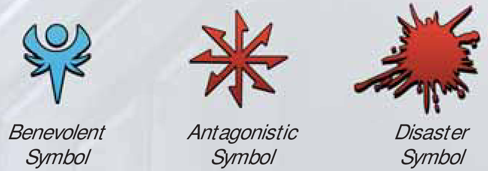

When drawing Trauma Tokens:

- Look at the tokens. If they are not "disaster" tokens, keep them next to your character sheet face down with any other tokens and do not reveal them to anyone.
- If one is a "disaster" token, reveal it.
   - If you are a human player, your character is executed, and the "disaster" token is returned to the pool. 
   - A revealed Cylon draws 2 more Trauma Tokens, then puts any "disaster" tokens back into the pool. (Note that those 2 new tokens could contain another "disaster", requiring 2 *more* tokens, etc.)

When instructed to draw multiple Trauma tokens, draw all of them at once, not one at a time, before resolving any "disaster" tokens.

#### Trauma tokens on locations

If a player starts their turn on a location with a Trauma Token, such as the Brig or Sickbay, they draw that token at the start of their turn and replace it with a new token from the pool.

### Trauma Tokens

Players must draw a Trauma token when they are sent to the Brig or Sickbay. In addition, a hidden Cylon who is executed must draw a Trauma token upon entering the Resurrection Ship. 

### Mood Pool

The Mood Pool represents the overall mood of the ship. Humans want the mood to be Benevolent, but must also keep their own stock of tokens Benevolent, and the reverse is true for Cylons. When encountering allies, they will be more likely to be helpful or hurtful based on the mood of the ship. 

The Mood Pool must always have the same number of tokens as there are players, except in the middle of an Ally encounter. When instructed to draw or discard tokens in any other way, players always use the regular pool, not the Mood Pool.

### Trauma phase

At distance 8, all players reveal their Trauma tokens. Human players count Benevolent tokens as positive and Antagonistic tokens as negative. Cylon players count Antagonistic as positive and Benevolent as negative. Each is weighted equally at either +1 or -1. 

Players total their net score and each does the following:

|  Net score  | Result                               |
|-------------|--------------------------------------|
| -3 or lower | The player is executed.              |
|     -2      | Discard 4 Skill cards.               |
|     -1      | Discard 2 Skill cards.               |
|      0      | Nothing happens.                     |
|     +1      | Draw 2 Skill cards of any type.      |
|     +2      | Draw 4 Skill cards of any type.      |
| +3 or more  | Add or subtract 1 from any resource. |

### Ally cards

Ally cards represent other characters in the fleet who can help or hurt. They appear in various locations and have an associated Trauma token which indicates what they do when encountered. When a player ends their Movement step in a location with an Ally, they *must* encounter it. 

To encounter an Ally: 

1. Reveal the Trauma Token on that Ally's card. Follow the action on the card that is indicated by the token. If it is a "disaster" icon, do not resolve either action. The player encountering the Ally is not affected.
1. Remove the Ally card and token from the game. 
1. Discard the revealed Trauma token. 
1. Draw a new Ally card, and place its corresponding token on the indicated location.
1. The player who encountered the Ally chooses one of *their own* Trauma tokens and places it on the new Ally card without revealing it. If they have no Trauma tokens, use one from the pool without examining it. 

1. Draw a token from the Mood Pool and reveal it. Follow the action on the Ally card indicated by the token.
1. Remove the Ally card from the game. 
1. The player who encountered the Ally takes the Trauma token that was revealed, adds it to their own stock, and randomizes their tokens.
1. Draw a new Ally card, and place its corresponding token on the indicated location.
1. The player who encountered the Ally chooses one of *their own* Trauma tokens and secretly adds it to the Mood Pool, which is then shuffled. 

#### Placing a new Ally

Allies are always removed from the game if a player has used or is using the corresponding character for themselves. This includes characters that were played but have since been executed. When this occurs, keep drawing Allies to replace the removed Ally until one is found that has not been used. Remember that "Boomer" and "Athena" are *not* duplicates of each other, so they may coexist within the same game. 

Allies are not reused, so if the deck is depleted no more Allies are placed. 

#### Ally replaced with player, or location damaged

If a player chooses a character after an execution that corresponds with an Ally currently on the board, or if a location containing an Ally is damaged or destroyed, the Ally is removed from the game (without revealing the Trauma token) and a new non-duplicate Ally is drawn. 

The Cylon player with the most Trauma tokens chooses one of *their own* tokens to place on the new Ally. If there is a tie for most tokens, break the tie based on which player is closest to taking a game turn (or, in other words, the first player starting from the current player and proceeding clockwise). If there are no Cylon players with tokens, draw a random token from the pool to place on the Ally. 

After this occurs, the Cylon player with the most Trauma tokens may look at the entire Mood Pool and exchange one token from the Mood Pool with one of their own. If there is a tie for most tokens, break the tie based on which player is closest to taking a game turn (or, in other words, the first player starting from the current player and proceeding clockwise). If there are no Cylon players with tokens, nothing happens.

### Demetrius & Missions

Demetrius is another ship, and can be travelled to the same way as ships like Colonial One. Its locations cannot be damaged. 

To activate a Mission, place the top card of the Mission deck face up on the "Active Mission" space. It is immediately resolved. Missions have the following restrictions:

- The Skill check on a Mission card cannot be modified by character abilities or card abilities. This includes abilities that happen "before" or "after" Skill checks. 
- Skill Check Abilities are *not* resolved during a Mission.
- Mission cards are not Crisis cards, so abilities that apply to Crisis cards do not apply to Mission cards. 

Otherwise, Missions are resolved [in the same way as other Skill checks](#skill-check-resolution). Limits on how many cards a player may contribute *do* still apply when attempting a Mission. 

Mission cards *always* remain on the Active Mission space until the fleet jumps. Unless otherwise instructed, leave the Active Mission face up after it is finished. Since new Missions cannot be activated while a card remains, this means that only one Mission can be attempted per jump. 

Any distance gained from a Mission card applies _immediately_, even though the card is not supposed to be put next to the other Destination cards until the fleet jumps. This could trigger the Sleeper Agent phase or anything else that occurs at a specific distance. (The only reason it stays in the Active Mission space is to remind players that they cannot attempt another Mission until the next jump.)

Follow the instructions on the Active Mission space when jumping to clear the Active Mission. (Essentially, Missions without distance are always discarded, Missions with distance are shuffled back into the deck if failed or are put next to the other distance cards when passed.)

### Rebel Basestar (human or Cylon)

The Rebel Basestar is only accessible after it is added to the game by the "Cylon Civil War" Mission card. Depending on the result of this Mission, it is either a Cylon location or a human location. Players of the correct allegiance can travel to it by discarding a Skill card. As always, a Cylon Leader or a Sympathetic Cylon is considered a Cylon player unless they are Infiltrating, in which case they are a human player. 

For Raider Bay, the player is only allowed to activate the ships being placed, not any ships that were already present. Apollo may use "Alert Viper Pilot" to commandeer a viper placed using Raider Bay. In this case, Apollo can use the Action granted by "Alert Viper Pilot" in the middle of the Raider Bay Action, and the player using Raider Bay cannot activate Apollo's viper since it is being piloted. 

### Character sheets

Each character's sheet lists these items:

- Type. Used for selecting a well-rounded group of characters to start.
- Abilities. These include
    - A standard ability, which may be an action or a passive trait.
    - A "once-per-game" ability, which can only be used once per gameis actually a bit of a misnomer with Daybreak, see ["Once per game"](#once-per-game) below. 
    - A negative ability which must be followed during the game.
- Skill Set. These are the types of cards that your character draws. 
    - The numbers indicate how many of each type to draw at the start of your turn. For "multi-skills" like "1 Leadership/Engineering", you may choose between the two types while drawing. 
    - Otherwise, when drawing Skill cards, *they must be present in your skill set* unless otherwise instructed.
- Setup instructions. This tells you how to start the game with your character. 

A character ability that affects Crisis cards or Skill checks does *not* affect a Super Crisis card. 

The number next to each Skill type only applies to drawing cards at the start of a turn. If, for example, "Helo" was instructed to draw 2 Skill cards, he could choose 2 Piloting cards despite the line saying "1 Piloting". He could not draw any Politics cards because he does not have Politics anywhere in his Skill set. 

Players with "multi-skills" of multiple cards, like "2 Leadership/Politics", are allowed to split their choices, so a draw of 1 Leadership and 1 Politics is allowed. 

### Once per game

The "once per game" ability on a character sheet can be chosen by a player up to once in a single game. After that, it cannot be used again. This is tied to each player, not to a character or that specific ability, so if a player uses their once-per-game and is later executed, they may not use the new character's once-per-game ability. Conversely, an executed player who has not used their once-per-game is allowed to use their new character's once-per-game ability later.

Even when not playing with Daybreak, it's convenient to use that expansion's Miracle tokens to track whether each player has used their once-per-game or not. 

The Daybreak expansion changes the rules for character abilities specified as "once per game". They are now also known as Miracle abilities, and they may be used more than once per game. 

To use a Miracle ability, a player must first discard 1 Miracle token. Any player with a Miracle token may use their Miracle ability, even if they have used it before. Players who do not have a Miracle token may not use their Miracle ability. 

There is a limit of 1 Miracle token per player, and they cannot be exchanged or traded between players. Players who already have one cannot gain another. If instructed to give a Miracle token to another player, but no player is eligible to receive one, the Miracle token is not given to anyone. 

The Support version of Gaius Baltar is an exception to all of these rules: he may hold up to 3 Miracle tokens and has an action that allows him to give and take Miracle tokens from other players. 

### Loyalty cards

Players receive Loyalty cards at the beginning of the game and at the Sleeper Agent phase. Players must keep them secret unless another player is directed to look at them, not discussing their text or any other details other than claiming to be human or Cylon. Players may *imply* things about their Loyalty cards (for example, "I wouldn't examine my Loyalty cards if I were you" or "This is a waste of time") but may not discuss any specifics about the card's appearance or text. 

A player is on the Cylon team if *any* of their Loyalty card states "You Are A Cylon". Having both a "Cylon" and "Not A Cylon" means that you are on the Cylon team, even if you're still hidden. A hidden Cylon still wins or loses with the Cylons. 

When a player is allowed to examine just one Loyalty card from another player, it is chosen randomly. When choosing a target to inspect Loyalty cards, players must select a face down Loyalty card that doesn't belong to themselves if possible. If this is not possible, for example a player who is President and Admiral being instructed to inspect the President or Admiral's Loyalty card, nothing happens. 

#### Personal Goal cards

A Personal Goal card counts as a "Not a Cylon" card, but adds a secret goal for that character to accomplish which probably goes against the humans' goals. 

Personal Goals can be revealed as an action as long as certain conditions are met. After revealing, if the distance is 6 or less, the player must then shuffle 1 card from the "Not a Cylon" deck into the Loyalty deck and draw 1 new Loyalty card. 

If a human player has not revealed it by the end of the game, the resource listed on the card is reduced. This could cause the humans to lose at the last minute. 

If a revealed Cylon keeps a Personal Goal card hidden, resources are *not* lost at the end of the game, so it is probably in their best interest to pass it off using the "Resurrection Ship" locationby revealing as a Cylon before distance 7 is reached.

#### Final Five cards

A Final Five card counts as a "Not a Cylon" card, but can trigger special negative effects when revealed or examined. (Thematically, the Final Five are supposed to be Cylons, but they are not like the other seven and so they count as human for game purposes.)

When a player looks at another's Loyalty card and it turns out to be a Final Five card, they must immediately reveal it and return it to the other player, who resolves the text on the card, turns it face down again, and shuffles it with their other Loyalty cards if any. 

If, during an execution, a Final Five card is revealed, the text on the card is resolved by the executed player and the Final Five card is removed from the game. 

The current player may choose the order in which to resolve Final Five cards, but they must *all* be resolved, even if one of them causes the player who examined the Final Five cards to be executed midway through. 

Abilities on Final Five cards do not affect Cylon players. 

#### The Sympathizer
This card is sometimes added to the Loyalty deck after the first round of cards go out (so it will probably, but not always, appear in the Sleeper Agent phase). As it states on the card, this Loyalty card is immediately revealed and resolved when dealt to a human player. If any resource is in the red zone, The Sympathizer is sent to the Brig but remains a human player. If there are no resources in the red zone, The Sympathizer follows [the procedure for revealing as a Cylon player](#cylon-reveal-resolution), but does not draw a Super Crisis card. They are also not allowed to use the "Cylon Fleet" location. 

#### The Mutineer

The Mutineer is treated as a "Not a Cylon" card. The player with this card is referred to as "The Mutineer". 

Whenever a human player receives the Mutineer card, they must reveal the card. If it was received from the Loyalty deck, not another player, they must then draw another Loyalty card to replace it. Then, they must draw 1 Mutiny card and are stripped of any titles that they hold, giving them to the character highest in the [line of succession](#lines-of-succession) not including themselves. (This only happens when receiving the card. The Mutineer is allowed to gain or lose titles after that as normal.)

When resolving the Crisis card drawn at the end of their turn, if the Mutineer resolves a "Prepare for Jump" icon, they must draw 1 Mutiny card.

The Mutineer has a Mutiny card limit of 2 instead of 1, which means that they are not sent to the Brig upon drawing a second Mutiny card, but are sent there upon drawing a third.  

### Mutiny cards

Mutiny cards provide actions to players, usually with both some benefit and some drawback. They are kept secret from other players, and discarded face up next to the Mutiny deck. 

Mutiny cards cannot be drawn, held, or played by revealed Cylons, and revealed Cylons cannot be selected as the target of an effect that says to draw Mutiny cards. 

All human players have a limit of 1 Mutiny card except for the Mutineer, who has a limit of 2. 

#### Drawing a second Mutiny card

When a player draws a Mutiny card above their limit, they are immediately sent to the Brig unless specifically told not to do so (or incapable of moving to the Brig, such as when "Helo" is Stranded). If a player draws a Mutiny card while resolving their old Mutiny card, they have not exceeded the limit since [cards that are being resolved are no longer "yours" or "in your hand"](#timing). 

Once the move to the Brig is resolved or skipped, the player must immediately choose Mutiny cards to discard until they are at their limit again.

#### Discarding Treachery cards and gaining Mutiny cards

Some Treachery cards say to draw a Mutiny card if they are chosen to be discarded. Players are considered to have "chosen" *any time they discard* unless either

- a game effect directed them to choose randomly, or
- they were specifically instructed to discard "all" of their Skill cards, and no number was given.

Note that if a player is instructed to discard a specific number of cards, it is considered a choice even if they will have to discard all of their cards to reach that number.

Within one turn, a player does not draw more than 1 Mutiny card as a result of discarding Treachery. After the first Mutiny card is received, that text is ignored on subsequent cards discarded by that player for the rest of the turn. 

Cards being discarded after being added to a Skill check do not count as being chosen by anyone. Playing a card into a Skill check does not count as discarding it.

### Cylon Players

Players who have not revealed as Cylons are [considered human players, not Cylon players](#player-terminology), even if they are secretly a Cylon. Only revealed Cylons have the immunities listed below. 

Cylon players may choose to **ignore** the effects of Crisis cards, Final Five cards, and Skill Checks, unless they specifically say that they apply to Cylon players.

Cylon players are not allowed to:

- Move to non-Cylon locations (or be sent to the Brig or Sickbay).
- Use abilities or actions on non-Treachery Skill cards, Quorum cards, Mutiny cards, or their old human character sheet, including their once-per-game ability. They *are* allowed to use the abilities on Treachery cards, unlike human players.
- Be the target of an "Executive Order" or Quorum cards. 
    - If a Cylon reveals as the first action of an Executive Order, they are not allowed to use the second action.
- Contribute more than 1 card to Skill Checks.
- Reveal Loyalty cards, even if they say to "immediately reveal this card". 

A Cylon *is allowed* to make use of a "State of Emergency" when it is played, since it targets all players and not a specific player. In addition, "State of Emergency" continues to execute even if the player who played it uses it to reveal as a Cylon.  

#### Cylon Reveal resolution
Revealing as a Cylon is an action, as described on the "You Are A Cylon" Loyalty card. It can also happen involuntarily, for example as the result of an execution. 

<ol markdown="1">
  <li>If you revealed yourself as an action, complete the action listed on the “You Are a Cylon” card. If you were executed, or are in the Brig, you do not get to take the action.
    <ul>
      <li>Note that it says to only reveal <em>this</em> card, not others. Keep any other Loyalty cards secret!</li>
    </ul>
  </li>
  <li>Discard your hand of Skill cards down to 3.</li>
  <li>Discard any Quorum cards <em>attached to your character</em> (these are cards like “Assign Vice President”, not the <em>hand</em> of Quorum cards), any Mutiny cards, and any Miracle tokens.</li>
  <li>Lose any titles to the character highest in the <a href="#lines-of-succession">line of succession</a> for that title. All resources that are tied to that title (the hand of Quorum cards, nuke tokens, Destinations) travel with the title as-is, they are not discarded.</li>
  <li>Move to the “Resurrection Ship” location. If piloting a ship, that ship is returned to the Reserves.</li>
  <li>Draw a Super Crisis Card unless instructed otherwise.</li>
  <li class="daybreak">If you were the Mutineer, hand off the Mutineer card face up to the human player of your choice. They must follow the procedure for receiving the Mutineer card.</li>
  <li class="overlay">If the fleet has traveled 6 or less distance, look at the rest of your Loyalty cards, if any. Hand them all, face down, to <em>one</em> human player of your choice.</li>
  <li class="nooverlay">Keep your Loyalty cards hidden, and do not reveal <em>any</em> Loyalty cards for the rest of the game, even if they say to "immediately reveal" them. They can be passed off to other players at the Resurrection Ship.</li>
  <li>From this point on, follow the rules for a revealed Cylon. This includes <em>not</em> drawing a Crisis card at the end of your turn.</li>
</ol>

### Cylon Leaders

A Cylon Leader is a special player who plays with their own goals. In addition to being aligned with the winning team, a Cylon Leader will also need to accomplish other tasks, adding an extra challenge. These extra goals cannot be discussed or revealed, other than discussing which side the Cylon Leader is trying to help or hurt. 

The Cylon Leader needs to satisfy *all* conditions listed on their Agenda card in order to win. 

The Cylon Leader receives 2 Motive cards at the start of the game and 2 more at the Sleeper Agent phase. Each one has 2 components: an allegiance and a condition. The Cylon Leader may reveal a Motive card at any time as long as its condition is *currently* being met, even in the middle of an action or Crisis, or during another player's turn. If it *was* met earlier in the game but is not anymore, it cannot be revealed. Many Motive cards cannot be revealed until the end of the game; for these cards the Cylon Leader must wait until all other "end of game" effects have been resolved before they can be revealed.

In order to win, at the end of the game the Cylon Leader must have at least 3 Motive cards revealed, and at least 2 of the revealed cards must be aligned with the winning team. 

Cylon Leaders are normally treated like and follow the rules for revealed Cylons (when they are not [Infiltrating](#infiltrating)). Unlike revealed Cylons, Leaders keep and use their [character sheets](#character-sheets). Just like other players, they must draw from their Skill set unless otherwise specified. They also have positive abilities at their disposal, including a "once per game" or Miracle ability, and negative abilities which are followed at all times. 

### Sympathetic Cylon

The Sympathetic Cylon is a Cylon who does not necessarily agree with the Cylon's goals. They may want to help the humans or the Cylons, but also have other goals which they must complete in order to win. 

As stated on the card, the Sympathetic Cylon card is immediately revealed when dealt to a human player. The player [reveals as a Cylon](#cylon-reveal-resolution) but their alignment is not so simple. 

In this variant, ignore the instructions on the card about Agenda cards. After revealing, the Sympathetic Cylon receives 4 Motive cards from the Motive deck. Each Motive has an allegiance and a condition. A Motive card can be revealed at any time as long as its condition is *currently* being met, even in the middle of an action or Crisis, or during another player's turn. If it *was* met earlier in the game but is not anymore, it cannot be revealed. Many Motive cards cannot be revealed until the end of the game; for these cards the Sympathetic Cylon must wait until all other "end of game" effects have been resolved before they can be revealed.

In order to win, at the end of the game the Sympathetic Cylon must have revealed at least 2 Motive cards that are aligned with the winning team. 

After revealing, they also draw a Sympathetic Agenda card (the ones with 4-6 and Caprica Six on the back). The Sympathetic Cylon must meet all the conditions on the card to win at the end of the game. They are also allowed to [Infiltrate](#infiltrating) by using an action at the "Human Fleet" location.

The Sympathetic Cylon does not use their old human character sheet. It is disregarded just like a standard Cylon player. While Infiltrating, since they no longer have a Skill set, they draw in the normal fashion for a Cylon, drawing their choice of Skill cards of different types, but with a 1 card bonus, for a total of 3 Skill cards of different types. 

### Infiltrating

The Cylon LeaderSympathetic Cylon is allowed to Infiltrate by using an action at the "Human Fleet" location. A regular revealed Cylon is not allowed to Infiltrate. The "Infiltrating" card summarizes the rules for Infiltrating. While Infiltrating, the player follows the rules for *human* players, and is treated as a human player in all respects, with the following exceptions: 

- Infiltrators draw 1 extra Skill card (from their Skill set, as always)(of a different type from the other two) when they draw cards, for a total of 3.
- Infiltrators cannot hold titles. 
    - They may be assigned Quorum cards like "Mission Specialist" or "Arbitrator", since those are not titles, with the exception of "Vice President" since that requires the ability to become President. 
- Infiltrators may not play more than 2 cards into a Skill check. 
- An Infiltrator has a special action available to them: 
    - Action: End your Infiltration and move to the "Resurrection Ship". If you were in the "Brig", you must then discard down to 3 cards. 
- Any time an Infiltrator moves to the Resurrection Ship, either voluntarily using the above action or because of another game effect, they are no longer Infiltrating. They must discard any cards that a revealed Cylon cannot have.

Infiltration does not change what a player needs to do in order to win or lose. It only changes whether they are treated like a human player or a Cylon player by the rules and game effects. Infiltrators always ignore any instructions to add cards to or draw from the Loyalty deck. 

### Titles

Titles can only be held by human players. Cylon Leaders cannot hold titles even while Infiltrating. When a human is revealed to be a Cylon, the first player in the [line of succession](#lines-of-succession) for that title claims it. 

#### President
The President controls the hand of Quorum cards on behalf of the fleet and has to make choices on Crisis Cards. 

The hand of Quorum cards belongs to the human fleet as a whole, but is controlled and kept secret by the President. If the President title is transferred to another player for any reason, the new President also takes control of the hand of Quorum cards. They are not discarded or kept by the outgoing President. The President title card provides an additional action to draw Quorum cards, and some locations can only be used by the President. There is a 10 card limit to the hand of Quorum cards.There is no card limit for the hand of Quorum cards.

The "Consult the Oracle" card cannot be used on the Loyalty deck or the Agenda deck or the Motive deck.

#### Admiral

The Admiral controls the human fleet's nuke tokens and can use them with the action on the title card. The Admiral also chooses the destination when a jump occurs, and makes choices that specify the Admiral. In addition, if a game effect states that a civilian ship is to be placed, but does not say which space area, the Admiral may choose any area.

If the Admiral is in the Brig, they are stripped of their title. The new Admiral is the highest human player in the line of succession who is not in the Brig. The previous Admiral does not regain their title automatically upon leaving the Brig. If all eligible players are in the Brig, the title goes to the highest in the line of succession until a player leaves the Brig. The Admiral still retains their title if they are sent to Detention on New Caprica.

#### CAG (Commander, Air Group)

The CAG makes some Crisis decisions, and is in charge of placing civilian ships on the game board when no space area is specified. This typically occurs as a result of the Pursuit track advancing. 

When a game effects says to place a civilian ship on the board, but does not specify a specific space area, the CAG places the ship on the board. The CAG must choose a space area *without* a civilian ship already in it, if possible. 

The CAG title is lost upon being sent to the Brig, and follows the same rules as the Admiral title does in that situation. Also like the Admiral, Detention does not cause the CAG to lose their title.

### Lines of Succession

<a target="_blank" href="images/succession.jpg">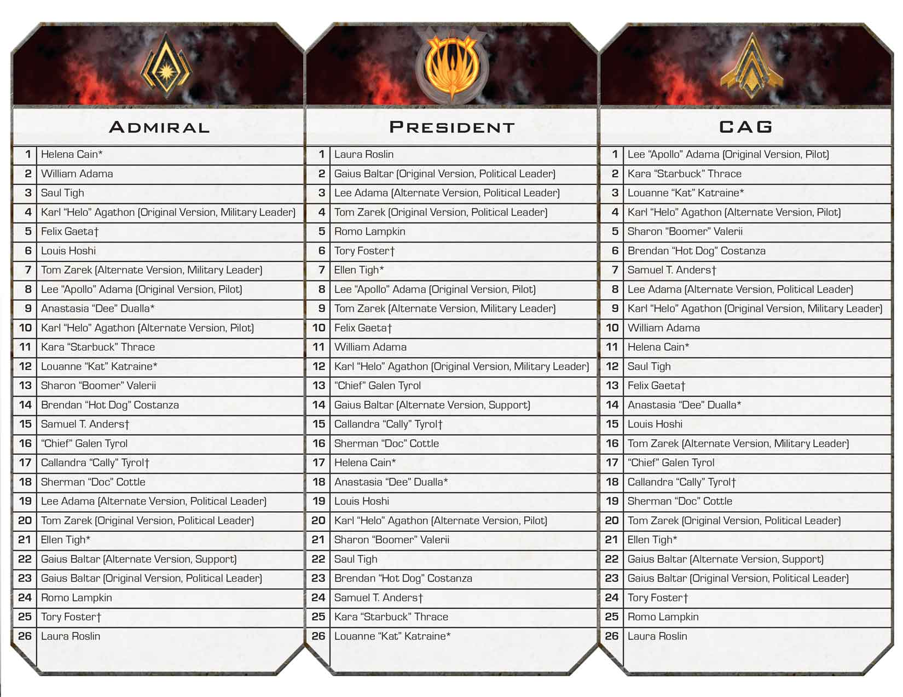</a>

Click the image above to see it full-sized in a new tab.

Unlike in real life, players do not gain titles solely because they are the highest in the line of succession. For example, if Helena Cain gets out of the Brig, she does not regain her Admiral title, even though she is first in the line of succession. When a player holds a title, they always keep it until they are instructed to give it to someone else. 

### Actions & Abilities

Cards, character sheets, and locations have various actions and abilities that are available to players to use. Players may play cards to use their abilities, use abilities on their own character sheets or on title cards that they hold, and use the action for their current location. A pilot may also use an action to activate the viper that they are piloting. 

An action will be indicated by the word "Action:", and can be used only when a player is granted an action. Other abilities indicate when they can be played and the effect that they will have. 

Cylon players are not allowed to use actions and abilities on old human character sheets, human locations, or non-Treachery Skill cards. Cylon players may use actions and abilities on Treachery cards, and human players may <em>not</em>.

#### Movement actions

A "Movement:" action is a special type of action which can be used by players *only* during the Movement step of *their* turn instead of moving their character. Any game effects that restrict or modify a type of action, like "may not use actions on Piloting Cards" or "discard 1 Skill card to use a Skill card action", also apply to Movement actions. 

The target of an "Executive Order" cannot use a Movement action because it is not their turn, and they are granted a [*move*, not a Movement](#moves-versus-movement-actions). 

Movement actions may be played while in the Brig, since players in the Brig still have a Movement step (they are just prevented from using it to *move*.)

### Moves

A player who is granted a "move" may move their character token to a new location. A move to a location on the same ship can be performed at no cost. There is no die roll or number of "spaces" that tokens have to move, the token simply moves directly from one location to another. 

Using a move to go to a location on another ship requires the player to first discard a Skill card. If a player has no Skill cards, they will not be able to move themselves to locations off of their current ship. The destination must be selected before the discard occurs, and the player's token is not moved until the discard is fully resolved. 

Players may not choose to move to "hazardous" locations, they can only be sent to them by game effects that specify that exact location. Human players are not allowed to move to Cylon locations and vice versa. 

Players piloting a viper may move their ship to an adjacent space area when granted a move. They may also discard a Skill card to move to a location on any ship and return their viper to the Reserves. Neither of these counts as a viper activation. 

#### "Sabotage" Treachery card interrupt

Since the "Sabotage" Treachery card interrupts a discard and damages Galactica, it interacts with moves between ships. The damage occurs during the discard, before the player's token has left its starting location (since, as stated above, the discard is fully resolved before moving). 

If the starting location is damaged, the character is instead sent to Sick Bay since they are still in the location when it is damaged. If the intended destination is damaged, the damage happens before the character gets there, so the move can be completed normally. If the destination was on Pegasus, but the damage destroyed Pegasus, the move is no longer legal so the player's move ends with their token remaining in the starting location. The moving player cannot change their destination after "Sabotage" is played. 

#### Moves versus Movement actions

There is a subtle difference between a "move" and a "Movement:" action. A "move" is the act of moving a character token, whether that is within a ship, across ships (discarding 1 Skill card), or piloting a viper to a new space area. When a card allows a player to move, or says that a player cannot move, these are what it is referring to. In contrast, a Movement action is an action that players may take *only during the Movement step of their turn* instead of moving. If an effect grants a "move", like Executive Order, this does not allow the player to use a Movement action instead. Similarly, although the Brig forbids *moving*, players may still use Movement actions during their Movement step while in the Brig.         

### Skill Cards

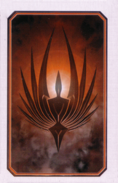

Skill cards have a type, a strength, and an ability. At the end of any player's turn, a player with more than 10 Skill Cards must discard down to 10. When discarded, Skill Cards go face up next to their respective deck. When a deck runs out, shuffle the discard pile to create a new deck. 

Cylon players are not allowed to use the text abilities on Skill Cards, with the exception of Treachery cards. Humans are the exact opposite: they may use the text abilities on all Skill Cards *except* Treachery cards. Unless otherwise specified, Treachery cards always count as negative when totaling Skill checks.

#### Skill Check Abilities

When the "Skill Check Ability" icon appears next to the strength of a Skill card, the text of the card is triggered only when it is revealed as a part of a Skill Check. Additional copies of the same card are not resolved. Since Skill Check Abilities are played anonymously, both human and Cylon players can contribute them to Skill Checkswhether they are Treachery or non-Treachery. 

#### Reckless cards and abilities

Some Skill cards have the word "Reckless" printed at the top of the text area. They are always abilities that apply at the beginning of a Skill check. When a Reckless ability is used, it makes the subsequent Skill check a Reckless one. Some Treachery cards have "Reckless Skill Check" abilities. These function like regular Skill Check Abilities, but are resolved only if the Skill check was made Reckless.A Reckless Skill check has a chance of triggering additional Treachery cards. 

Only one Reckless card may be played per Skill check. "Restore Order" cannot be played on a Skill check after it has been made Reckless, and Reckless cards cannot be played on a Skill check after it has had "Restore Order" applied to it. 

#### Types
<ul>
<li>Politics: This skill represents a character’s ability to control morale and help the fleet overcome crises. This is the most common skill type required by Crisis Cards. Some politics cards also provide the ability to allow a player draw Skill Cards from outside his skill set.</li>
<li>Leadership: This skill represents a character’s ability to take charge of situations and command other individuals. This is the second-most common skill type required by Crisis Cards. Some leadership cards allow players to move other characters and grant them a bonus action.</li>
<li>Tactics: This skill type represents a character’s ability to plan missions as well as to physically overcome obstacles. Tactics cards allow players to gain bonuses to die rolls as well as scout the galaxy for new destinations.</li>
<li>Piloting: This skill represents a character’s ability to fly vipers. Piloting cards allow players to reroll enemy attack rolls as well as gain additional attacks.</li>
<li>Engineering: This skill represents a character’s strength in the mechanical and scientific fields. Some engineering cards allow players to repair vipers and locations aboard Galactica.</li>
<li class="treachery">Treachery: This skill represents nefarious and underhanded tactics. Unlike other Skill types, it is primarily used by Cylon players. </li>
</ul>

#### Destiny Deck

To create the Destiny deck, take two of each type of Skill Card (including Treachery) and shuffle. These are used in each Skill Check to add uncertainty and plausible deniability for hidden Cylons. After the last card is used from the Destiny deck, form a new one.

### Crisis card resolution

1. Draw a Crisis card.
2. Reveal the Crisis card and read it.
   - Starbuck's "Secret Destiny" takes place before Baltar's "Delusional Intuition". (Baltar's text should really say "after revealing".)
3. Resolve the Crisis based on whether it is [a Cylon attack](#cylon-attack-cards),  [a Skill Check](#skill-check-resolution), or an [event](#event-crisis-card). 
4. [Activate Cylon Ships](#activating-cylon-ships) as directed by the bottom left corner of the Crisis card.
5. If the "Prepare for Jump" icon is present in the bottom right corner, advance the fleet token 1 space. This may trigger [a jump](#jumping-the-fleet). 
6. Discard the Crisis card unless otherwise indicated. 

### Cylon Attack cards

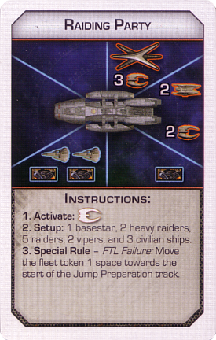

Each Cylon Attack Crisis has 3 steps:

1. Activate: Fully resolve the indicated [Cylon ship activation](#activating-cylon-ships) before adding new ships to the board.
2. Setup: Place new ships on the board as shown in the image. The text lists the exact numbers. 
3. Special Rule: The given special rule now applies. If the rule does not say to "keep this card in play", the Crisis card is discarded afterward.   

The ships shown are *new* ships to be placed. Any existing ships on the board stay where they are when performing "Setup". If there are not enough ships, follow [the component limitation rules](#component-limitations). Abilities that occur when a ship is placed, such as Apollo's "Alert Viper Pilot", may take place immediately after the setup phase is complete.

### Event Crisis cards

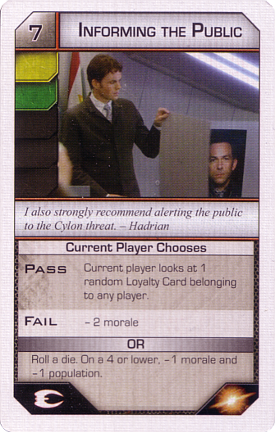

An "Event" Crisis card has a bar below the picture that says "[Someone] Chooses", with a specific player or title named, as well as an "or" bar between the two choices. 

The indicated player must choose which box to resolve before play can continue. In some cases, both boxes simply have text to be resolved. In others, one of the choices is to attempt a [Skill check](#skill-check-resolution). 

When making a choice, unless specifically stated otherwise a player may select which box gets resolved even if they know that they will not be able to actually fulfill that option. For example, if the choice is between "lose 1 morale" and "the President discards 5 Skill cards", the second option can be chosen even if the President has no Skill cards. However, remember that [restrictions apply to which players can be sent to the Brig or Sickbay](#choosing-players-for-sickbaybrig). 

### Super Crisis Cards

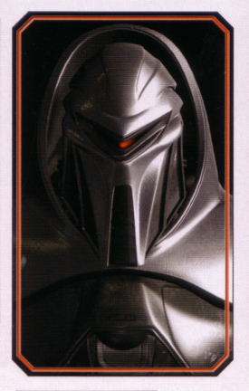

Abilities that apply to Crisis cards do not apply to Super Crisis cards. Super Crisis cards are also immune to all character abilities affecting Skill checks. Otherwise, they are resolved using [the same procedure as Crisis cards](#crisis-card-resolution).

### Skill Check resolution

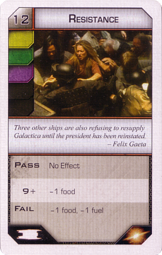

Each Skill check has a strength in the top left corner, a title, a picture, and colors which count as positive. Any color not "lit up" is negative, and will subtract from the positive cards. Two cards from the Destiny deck are secretly added to the Skill check when it begins. 

Starting with the player to the left of the current player, each player secretly contributes their choice of cards, face down, into the Skill check. The current player goes last. Human players may normally contribute any number of cards, including zero. The number of cards added is public knowledge. Cylon players and players in the Brig may only contribute up to 1 card. 

The result of the Skill check will determine which of the boxes at the bottom will take effect. A Skill check is passed if it meets or exceeds the strength in the top left corner. There may be a "partial pass" result if the strength reaches a certain threshold but doesn't fully pass, but otherwise the Skill check fails. 

If a card is revealed in a Skill check with the Skill Check Ability icon, resolve the card's text. If multiple cards with the same name appear, only one is resolved and the rest are skipped. If multiple Skill Check Abilities are present, the current player decides what order they are resolved in. 

If the Skill Check Ability icon appears as a result, that result is triggered if at least 1 Skill Card with a Skill Check Ability icon was played into the check, in addition to the result of the Skill check. 

The full, detailed procedure for resolving a Skill check is as follows:

<ol>
  <li>The Skill check begins.
    <ul>
      <li>Resolve any abilities that cause the entire check to pass or fail without any attempt required, such as “Political Prowess” or Boomer’s “Mysterious Intuition”</li>
    </ul>
  </li>
  <li>The “pre-card” abilities can now occur, with the exact order chosen by the current player if multiple cards are played at once.
    <ul>
      <li>This includes abilities with text that says:
        <ul>
          <li>“before making a skill check”</li>
          <li>“before cards are added to a Skill check”</li>
          <li>“when a player activates [some location]”</li>
        </ul>
      </li>
      <li>When the current player chooses an effect to go first, the rejected effect can be withdrawn. If it was on a card, the owner takes the card back.</li>
      <li class="pegasus">Only one Reckless card may be applied to a Skill Check. Reckless cards cannot be played after “Restore Order” has been applied.</li>
      <li class="pegasus">“Restore Order” cannot be played after a Reckless card has been applied.</li>
      <li class="pegasus">When Dee uses her “Fast Learner” to add cards to the Skill check, they aren’t <em>officially</em> added until after the Destiny deck’s cards. This means that more “pre-card” effects can be played even after “Fast Learner” has been used.</li>
      <li class="pegasus">Players can receive new cards from “Support the People” and use them as additional “pre-card” effects as well.</li>
    </ul>
  </li>
  <li>Add 2 cards face down from the Destiny deck (followed by Dee’s “Fast Learner” cards if any)</li>
  <li>Starting to the left of the current player and proceeding clockwise, each player plays cards face down into the Skill check. The current player goes last.
    <ul>
      <li>Unless otherwise specified, a player may play any number of Skill cards into the check, including zero. The number of cards that a player is adding is considered public information.</li>
    </ul>
  </li>
  <li>Shuffle the Skill check cards</li>
  <li>Reveal the Skill check cards
    <ul>
      <li>Caprica Six’s “Human Delusion” occurs before Cally’s “Quick Fix” if both are attempted</li>
    </ul>
  </li>
  <li class="expansion">Resolve Skill Check Abilities, with the order being chosen by the current player.
    <ul>
      <li class="pegasus nodaybreak">“Reckless Skill Check” abilities only take effect if the Skill Check was made Reckless</li>
      <li>The effects from cards with the same name are not resolved more than once during this step. Any subsequent duplicates are ignored.</li>
      <li>If a card is removed after its effect has taken place, the effect still remains. (For example, if “All Hands on Deck” is resolved but removed later, all 0 strength cards still count as strength 1 later on.)</li>
      <li>“Red Tape” and “Quick Thinking” refer to the printed value on the card only, not values after any modification.</li>
    </ul>
  </li>
  <li class="pegasus daybreak">If the Skill Check was made Reckless, do the following:
    <ol>
      <li>Draw and show 1 Treachery card</li>
      <li>If it is strength 0:
        <ul>
          <li>Draw and show 1 more Treachery card</li>
          <li>Resolve both Skill Check Abilities.
            <ul>
              <li>Note that the “cards with the same name” rule no longer applies, so neither card should be ignored or skipped as a duplicate.</li>
            </ul>
          </li>
          <li>Remove both cards from the check and discard them. They do not count toward the Skill check’s strength.</li>
        </ul>
      </li>
      <li>If it is not strength 0, it is discarded with no effects.</li>
    </ol>
  </li>
  <li class="expansion">If the Crisis card has a "Skill Check Ability" outcome, resolve it. 
    <ul>
      <li>These are called Consequences. The text is resolved if at least 1 Skill Card with a Skill Check Ability icon was played into the check. They are indicated by a “Skill Check Ability” icon on the Crisis card, similar to the “Pass” and “Fail” results.</li>
    </ul>
  </li>
  <li>Total the net strength of the cards (positive minus negative), taking into account any effects that modified them
    <ul>
      <li>Of course, players are allowed to do their own counting at any time. This step simply indicates calculation of the final result.</li>
    </ul>
  </li>
  <li>Determine outcome: Pass, partial pass, or fail
    <ul>
      <li>“A Second Chance” now applies if it was played</li>
      <li>Abilities that change the amount required to pass a Skill check do not change the amount required for a “partial pass”.</li>
    </ul>
  </li>
  <li>Resolve the outcome’s effects
    <ul>
      <li>“Install Upgrades” now applies if it was played</li>
    </ul>
  </li>
  <li>Discard Skill cards into their appropriate discard piles
    <ul>
      <li>William Adama may override this with “Command Authority”</li>
    </ul>
  </li>
</ol>

### Activating Cylon ships

Appropriately, Cylon ships follow certain programming when activated. Cylon players don't pilot or otherwise control these ships directly. 

When resolving a result with multiple Cylon activations, resolve them in left to right order. 

If there are not enough tokens to place ships on the board, the current player chooses which to place, and the rest are skipped due to [component limitations](#component-limitations). When the Cylon Fleet board is present and a ship must be placed on the main board, first draw from the regular reserves if possible, then draw from the Cylon Fleet board starting in the lowest numbered space. This does not move other ships in the space area and does not increase the Pursuit track. 

Ships on the Cylon Fleet board do not move or launch other ships unless otherwise stated. For example, when resolving a "Launch Raiders" icon, do not launch raiders from basestars on the Cylon Fleet board.

When these icons appear on a Crisis card, do the following:

- Activate raiders: [Each Cylon raider is activated once](#activating-a-raider). Resolve one space area at a time, with the current player choosing the order of space areas. If there are no raiders on the board, each basestar launches two new raiders. If there are no raiders and no basestars on the board, place a raider on the Cylon Fleet board as specified belownothing happens. 
- Launch raiders: Each basestar launches 3 raiders. If there are no basestars, place a basestar on the Cylon Fleet board as specified belownothing happens.
- Activate heavy raiders and Centurions: Follow [the procedure for activating heavy raiders and Centurions](#activating-heavy-raiders-and-centurions). If there are no basestars, centurions, or heavy raiders, place a heavy raider on the Cylon Fleet board as specified belownothing happens. 
- Activate basestars: Each basestar [attacks Galactica](#combat-ship-attack-table). If there are no basestars, place a basestar on the Cylon Fleet board as specified belownothing happens. 

To place a ship on the Cylon Fleet board:

1. Note the appropriate ship based on the Activate Cylon Ships icon:
    - Activate Raiders: 1 raider
    - Activate Heavy Raiders/Centurions: 1 heavy raider
    - Launch Raiders or Activate Basestars: 1 basestar
2. If there is an appropriate ship in the normal stock, then roll a die and place that ship in the Cylon space area with that number.
    - This die roll **may** be affected by game effects or abilities. 
3. Otherwise, if the stock of appropriate ships is depleted:
    - Find the highest numbered Cylon space area containing the appropriate ship, and move *all* ships from that Cylon space area to the corresponding area on the main board.
    - If the appropriate ship is not on the Cylon Fleet board at all, no ships move over.
4. Finally, advance the Cylon pursuit marker one space. 
    - If it has reached a space with civilian ships underneath it, the CAG must place the indicated number of civilian ships on the main board. 
    - If it has reached "Auto Attack", move *all* ships in Cylon space areas to their corresponding main space areas and reset the Cylon pursuit marker. 

#### Activating a raider

Cylon raiders follow a simple program when they are activated. An individual Cylon raider always does the *first available* action in this list and then stops:

1. Attack an unmanned viper in its space area
2. Attack a manned viper in its space area
3. Destroy a civilian ship in its space area
4. Move one space area closer to the nearest civilian ship. If two such space areas are equal in distance, the raider moves clockwise. 
5. If there are no civilian ships, the raider attacks Galactica. 

When all Cylon raiders are activated, they are resolved one entire space area at a time. If multiple space areas have raiders in them, the current player chooses what order they are resolved in, and sometimes this makes a big difference! 

If a raider moves to another space area that hasn't been resolved yet, it is not activated a second time. Make sure to keep it separate from the ships that have not been activated yet. 

#### Activating heavy raiders and Centurions

When heavy raiders are activated, do *all* of the following steps: 

- Move all centurions on the board one 1 space further on the Boarding Party track
- If a heavy raider is already in a space area with a launch icon, it is removed from the board and replaced with a Centurion on the start of the Boarding Party track (if there are not enough Centurion tokens, leave the heavy raider in space). 
- Move all heavy raiders on the board one space area closer to the nearest viper launch icon
- If there were no heavy raiders on the board to start, launch one from each basestar. 

When something says to "activate heavy raiders", that *always* includes Centurions as well unless otherwise stated. If something does say to activate heavy raiders but not Centurions, skip the first step but do all of the rest. 

Multiple Centurions can occupy the same space at the same time, they do not "push" each other forward. 

If a heavy raider would normally enter a viper launch tube, but there are no Centurion tokens, it stays on the board since it cannot be converted to a Centurion. As always, the current player decides which order to resolve them in. 

### Jumping the fleet

The human fleet normally jumps by either activating the "FTL Control" location on Galactica, or having the fleet token reach "Auto-Jump". 

When "FTL Control" is used to jump, the player activating it must first roll a die, and on a 6 or lower, the population indicated by the current Jump Preparation space is lost (either -3 or -1). After this is finished, the jump can begin. (The base game rulebook incorrectly refers to the player activating "FTL Control" as the "current player".)

When the "Lured Into a Trap" Super Crisis card is in play, handle the executions *after* the jump is resolved. The executions still occur during <a href="#final-jump">the final jump</a>, and could cause <a href="#human-loss">the humans to lose</a>. 

The procedure for jumping is:

<ol>
  <li class="demetrius">Follow the instructions on the Active Mission space.</li>
  <li class="cylonfleet">Move all Cylon ships to the respective space area on the Cylon Fleet board. When moving a damaged basestar, discard any damage tokens attached to it. Centurions remain where they are on the Boarding Party track.</li>
  <li class="cylonfleet">Return all <em>vipers</em> to the Reserves, but leave all civilian ships in place. Pilots who were flying ships move to the Hangar Deck. Pilots of assault raptors may choose to remain in space, and the current player may choose to leave unmanned assault raptors in space.</li>
  <li class="nocylonfleet">All ships on the game board are removed and returned to their respective pile, the Reserves, etc. unless otherwise specified. Pilots who were flying ships move to the Hanger Deck. Centurions are <em>not</em> removed. The current player may choose to leave unmanned assault raptors in space, and pilots of assault raptors may choose to remain in space.</li>
  <li>The Admiral draws 2 Destination cards and, without discussing or showing them, chooses 1 as the next destination for the fleet. The other Destination card is placed at the bottom of the Destination deck and remains secret.</li>
  <li>Follow the instructions on the chosen Destination card. </li>
  <li>The fleet gains the distance indicated at the bottom of the card. If the Objective card specifies something that happens at this new distance, resolve that event completely.</li>
  <li>Reset the Jump Preparation track to the start.
    <ul class="ioniannebula">
      <li>If the “Crossroads” phase was just resolved, skip this step (since the Crossroads phase resets the jump track when it starts).</li>
    </ul>
  </li>
</ol>

### Sleeper Agent phase

At the Sleeper Agent phase, more Loyalty cards are dealt to every player except for Cylon Leaders. Players who were not Cylons may discover that they were sleeper agent Cylons all along. It begins when the distance specified on the Objective card is reached. 

Upon reaching this distance or more, deal 1 Loyalty card to every player who is not a Cylon Leader, including revealed Cylon players.  Revealed Cylons must ignore any text that says to "immediately reveal this card". Deal 2 more Motive cards to the Cylon Leader.

If the "You Are The Mutineer" card was added to the Loyalty deck, but no one has revealed as the Mutineer after all the Sleeper Agent phase cards have been dealt, the current player chooses a human player to draw an extra Loyalty card from the Loyalty deck. If they draw and reveal The Mutineer, they should ignore the card text about drawing another Loyalty card. 

#### Revealed Cylons during the Sleeper Agent phase

Revealed Cylon players who receive Loyalty cards must look at them, then immediately pass them face down to *one* human player of their choice. They must not follow any text that says to "immediately reveal this card".

Revealed Cylons get their extra Loyalty card, but are not allowed to reveal it (even if it says to "immediately reveal this card"). Instead, they can choose to pass them off as an action in the Resurrection Ship when the game resumes. Existing Cylons are never allowed to reveal another Loyalty card. A Cylon player who receives the "You Are a Sympathizer" card may choose to instead hand it off to the human player of their choice as soon as they receive it.

Sharon "Boomer" Valerii normally receives 2 Loyalty cards in the Sleeper Agent phase instead of 1, as per her negative ability. If "Boomer" has already revealed as a Cylon, however, her negative ability no longer applies because character abilities are ignored as a revealed Cylon. Only deal her 1 Loyalty card if she has revealed as a Cylon.

Sharon "Boomer" Valerii normally receives 2 Loyalty cards in the Sleeper Agent phase instead of 1, as per her negative ability. But if "Boomer" has already revealed as a Cylon, her negative ability is supposed to no longer apply. Since following this rule would result in a Loyalty card not being dealt, deal the extra card to "Boomer" despite technically no longer having that weakness so that there is not a card left over.

### Combat ship attack table 

<table>
	<tr><th> Ship being attacked</th> <th> Result </th></tr>
	<tr><td> Cylon raider              </td> <td> 3–8: Destroyed</td></tr>
	<tr><td> Heavy raider or Centurion </td> <td> 7–8: Destroyed</td></tr>
	<tr><td rowspan="3" id="basestardamage"> Basestar      </td> 
	                         <td>With viper: 8 to damage           </td></tr>
	    <tr class="daybreak"><td>With assault raptor: 7–8 to damage</td></tr>
	                     <tr><td>With Galactica: 5-8 to damage     </td></tr> 
	<tr class="nocylonfleet"><td>With a nuke:	                             <ul>
	                               <li>1–2: Damaged twice</li>
	                               <li>3–6: Destroyed</li>
	                               <li>7–8: Destroyed, and also destroy 3
	                                   raiders in the same space area</li>
	                             </ul>                             </td></tr>
	<tr><td> Viper                   </td> <td> 
	                             <ul>
	                               <li> 5–7: Damaged </li>
	                               <li> 8: Destroyed </li>
	                             </ul>
	                                                               </td></tr>
	<tr class="cylonfleet"><td> Viper mk VII            </td> <td> 
	                             <ul>
	                               <li> 6–7: Damaged </li>
	                               <li> 8: Destroyed </li>
	                             </ul>
	                                                               </td></tr>
	<tr class="daybreak"><td> Assault raptor          </td> <td> 7–8: Destroyed </td></tr>
   <tr><td rowspan="2"> Battlestar Galactica    </td> 
                              <td> With raider: 8 to damage       </td></tr>
                          <tr><td> With basestar: 4–8 to damage   </td></tr>

</table>

With the Cylon Fleet board, a nuke targets an entire space area:

- 1–2: Damage a basestar twice
- 3–6: Destroy a basestar
- 7: Destroy a basestar and 3 raiders
- 8: Destroy every ship in the space area

When a human combat ship is destroyed, it is removed from the game. If it was piloted, that character is moved to Sickbay. Cylon ships are not permanently destroyed by an attack, they are just returned to the pile next to the board. 

#### Basestar damage

Basestars are destroyed after taking 3 damage tokens. When a basestar is damaged, draw a token and put it face up next to the damaged basestar. Each token has an additional side effect:

| Image | Name | Effect |
|-------|------|--------|
|  | Critical Hit | Counts as 2 damage tokens instead of 1 |
|  | Disabled Hangar | When this basestar launches raiders or heavy raiders, nothing happens |
| 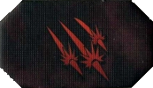 | Disabled Weapons | When this basestar fires on Galactica, nothing happens |
| 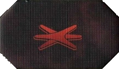 | Structural Damage | When this basestar is attacked, add 2 to the die roll |
|  | Collateral Damage | When this token is first added to the basestar, destroy 3 raiders in the same space area |
| 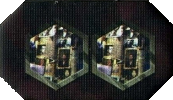 | Damage to Personnel | When this token is first added to the basestar, each Cylon player must draw 2 Trauma tokens. |

| Image | Name | Effect |
|-------|------|--------|
|  | Critical Hit | Counts as 2 damage tokens instead of 1 |
|  | Disabled Hangar | When this basestar launches raiders or heavy raiders, instead nothing happens |
| 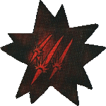 | Disabled Weapons | When this basestar fires on Galactica, instead nothing happens |
| 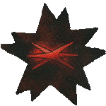 | Structural Damage | When this basestar is attacked, add 2 to the die roll |

If a game effect instructs you to "destroy a basestar", it is destroyed without drawing damage tokens. Additionally, do not draw a damage token if a basestar with 2 damage is damaged again.A basestar with 2 damage tokens that is damaged again should have another token drawn before destroying it, since some types of damage have effects outside of the basestar itself.

#### Damaging Galactica

Galactica is the main military ship in the fleet. It is destroyed when it has 6 damage tokens on it. If Galactica is destroyed, the humans lose. 

When Galactica is damaged, draw a Galactica damage token randomly and reveal it. If it shows a resource icon, lose 1 of that resource and remove that damage token from the game. If it shows an image of a location, that location is damaged. When a location is damaged, any characters in that location at that time are sent to Sickbay. Leave the token on that location to indicate that it is damaged. Damaged locations can be moved to as normal, but the action on a damaged location cannot be used until it is repaired again. When it is repaired, the damage token is shuffled back into the damage token pile.

#### Damaging Pegasus

When Galactica is damaged, the current player may choose to have Pegasus take the damage instead. Pegasus has its own damage tokens which behave the same as Galactica's. There are no "resource" icons on Pegasus damage tokens, just Pegasus locations. Pegasus is destroyed if all 4 locations on it are damaged. Any characters on board Pegasus when it is destroyed are sent to Sickbay, and the Pegasus board is removed from the game. 

#### Scar

Scar is a special raider. He can only be destroyed as the result of a die roll of 7 or 8. Modifiers to die rolls are allowed, so a roll of 6 with "Strategic Planning" would destroy Scar. If a nuke is used, and one of its effects is to destroy raiders, Scar can only be chosen if the die roll for the nuke was a 7 or 8. If a game effect includes a roll to see "how many" raiders to destroy, Scar can be chosen only if that roll was a 7 or an 8. 

If a game effect allows you to destroy a raider without a die roll, Scar cannot be chosen. Kat's "Hot Shot" ability skips the die roll entirely, and so cannot be used to destroy Scar. 

### Human combat ships

#### Civilian ships

Civilian ship tiles represent vulnerable ships in the human fleet. Civilian ships have no defenses; when attacked they are immediately destroyed with no die roll. The tile is turned over to reveal its contents. The fleet loses the indicated resources (usually population) and the ship token is removed from the game. 

When instructed to place a civilian ship and no space area is specified, the CAG places it in an area without a civilian ship if possiblethe Admiral may place it in any space area. During the New Caprica phase, when a ship is evacuated, the current player chooses which space area to place it in. (When evacuating, the only choices are either bottom left or bottom right). 

##### Drawing and destroying

When an event instructs players to "draw a civilian ship and destroy it", they are drawn randomly from the stockpile of ships next to the board first, not the main game board. If the only civilian ships left are those on the main board, however, the current player must choose one to destroy. 

During the New Caprica phase, draw ships to be destroyed from the regular pile first, then the Locked civilian ship stack, then the Prepared civilian ship stack, and finally the main game board. Note that this is *only* for drawing a civilian ship to destroy it, not for any other placement or drawing of civilian ships.

#### Raptors

Raptors aren't used in space areas. Instead, certain game actions will "risk" them (presumably, you are sending them on a dangerous mission to deep space), and a failure will cause them to be destroyed. Just like the other human ships, when destroyed they are removed from the game. If there are no raptors left, players may not use abilities that require risking a raptor. 

Unlike other combat ships, raptors are usable during the entire New Caprica phase. Players may risk raptors even before Galactica returns to orbit. 

#### Vipers

A player who is activating a viper can do one of the following:

<ul>
  <li>Launch the viper from the Reserves and place it in one of the two space areas with a viper launch icon</li>
  <li>Move the viper to an adjacent space area. (There is no flying “above” or “below” Galactica, even though this is outer space.)</li>
  <li><a href="#combat-ship-attack-table">Attack</a> a Cylon ship in the same space area with the viper.</li>
  <li class="cylonfleet">Escort a civilian ship in the viper's space area to safety. The civilian ship is returned to the unused pile, and the viper does not move.</li>
</ul>

When damaged, a viper goes into the "Damaged Viper" box on the board. It may not be launched or used until it is repaired. 

The "Evasive Maneuver" card can only be used when a viper is being "attacked". When any other effect says that a viper is damaged or destroyed, such as "Main Batteries", an "Evasive Maneuver" cannot be used because it is not being attacked.

Under the effects of the "Gravity Well" special rule (on the Event Horizon Crisis), a Skill card must be discarded to activate a viper. For "Command", or any other card that allows a player to activate a viper, 1 card must be discarded for each activation. Actions that allow for moving or attacking with a viper, like "Maximum Firepower" or "Full Throttle", only require 1 card to perform the entire action even if it involves multiple attacks or moves. A pilot moving their own ship during their Movement step or with the first step of an Executive Order is performing a move, not an activation, so a card does not need to be discarded. 

#### Mark VII Vipers

The mark VII is a more advanced model of viper. Although they start out damaged, when repaired they are more powerful than regular vipers. Except where noted here, they are treated exactly the same as vipers for all game effects. 

When moving, a mark VII viper may move 2 space areas instead of 1. This includes both manned and unmanned vipers. A mark VII viper is damaged on a 6 or 7, and destroyed on an 8. 

When placing, destroying, activating, or launching a viper, players may choose to use a mark VII viper if one is available instead. 

#### Assault raptors

Assault raptors are raptors that have been upgraded for combat instead of reconnaissance, and cannot be used to "risk a raptor". Instead, except where noted here, they are treated exactly the same as vipers for all game effects. 

When the fleet jumps, a character piloting an assault raptor may choose to stay in their space area. An unmanned assault raptor may remain in space if the current player chooses. Assault raptors are destroyed on a 7 or an 8 and are never damaged. If instructed to "damage a viper" and an assault raptor is chosen as the target, it is destroyed instead. 

When placing, destroying, activating, or launching a viper, players may choose to use an assault raptor if one is available instead. 

 

#### Piloting

Any character with piloting in their skill set is allowed to fly a viper themselves. These characters have a piloting token in addition to their regular character token, used to represent which viper they are flying. These are manned vipers, as opposed to unmanned ones. Manned vipers follow the same rules for [activation](#vipers), however a manned viper can only be activated by its pilot. The pilot of a viper that is damaged or destroyed is sent to Sickbay. 

When granted a [move](#moves), a pilot may move their ship to an adjacent space area at no cost. By discarding 1 Skill card, a pilot may move to a location on any other ship just like other characters. 

A pilot may activate their own viper as an action. This could mean moving twice in a single turn, first as a move and again as a viper activation. Note that discarding a card to move to another ship is *not* available as an action or activation, it is strictly a move. 

Unless otherwise indicated, whenever a pilot stops piloting, their viper is returned to the Reserves. This includes voluntarily moving to a ship location by discarding a card or being involuntarily moved to the Hangar Deck, Sickbay, Brig, Resurrection Ship, etc. 

### Execution

#### First steps

If your character is executed, discard your entire hand of Skill Cards, as well as any Quorum cards <em>attached to your character</em> (these are cards like “Assign Vice President”, not the <em>hand</em> of Quorum cards), any Mutiny cards, and any miracle tokens. 

If you were the current player when you were executed, resolve the execution and then skip your remaining move, action, and Crisis steps. If an Ally executed you, replace the Ally <a href="#ally-replaced-with-player-or-location-damaged">as if it were in a location that got damaged</a> after your execution is finished.

After that, the execution proceeds differently based on whether you are actually a human or not. 

#### Finishing a Cylon execution

If you are a hidden Cylon, reveal <em>one</em> “You Are a Cylon” card and keep the rest of your Loyalty cards face down. Do not take the action on that card. Take 1 Trauma token from the pile (not the Mood Pool). Follow <a href="#cylon-reveal-resolution">the rest of the normal procedure for revealing</a> as a Cylon, but do not draw a Super Crisis card.

If you are a Cylon Leader or a Cylon who has already revealed, move to the “Resurrection Ship” location and take 1 Trauma token from the pile (not the Mood Pool). If piloting a ship, that ship is returned to the Reserves. As always, Cylon Leaders <em>do not reveal their agenda or motive!</em>

#### Finishing a human execution

<ol>
  <li>Reveal <em>all</em> your Loyalty cards, showing that none are Cylon cards. For “Final Five” cards, resolve the text for execution.</li>
  <li>The fleet loses 1 morale. (If this causes Dee to be executed, resolve her execution after this one is finished.)</li>
  <li>Return your character and token(s) to the box, removing them from the game. Discard any Trauma tokens.</li>
  <li class="exodusloyalty">Discard all of your loyalty cards.</li>
  <li class="noexodusloyalty">If you were Boomer, and the Sleeper Agent phase hasn’t happened yet, draw 1 new Loyalty card.</li>
  <li>Choose a new character, with no restriction on type. You may not choose an alternate version of an existing character, and you may not choose a Cylon Leader. If there are no more characters left, the humans lose.</li>
  <li>Start in the normal Setup location for that character, or the Hangar Deck if that location is completely unavailable or nonexistent. During the New Caprica phase before Galactica returns, start in Resistance HQ.</li>
  <li class="exodusloyalty">Add 1 card from the “Not a Cylon” deck to the Loyalty deck, shuffle, and draw 1 new card. If you were playing as Boomer when you were executed, and the Sleeper Agent phase hasn’t happened yet, draw 1 more Loyalty card.</li>
  <li>Distribute any titles you had when you were executed to the first in the <a href="#lines-of-succession">line of succession</a>, including your new character. Titles held by other players do not change, even if your new character is higher in the line of succession.</li>
  <li class="daybreak">If the executed character was the Mutineer, your new character receives the Mutineer card again, following the instructions on the card as if they just received it face up.</li>
  <li class="allies">Draw 3 new Trauma tokens. If a “disaster” token is drawn, set it aside and draw a new one to replace it, then return the “disaster” token to the pool, just like at the start of the game.</li>
</ol>
  
If your new character is one of these, there are some additional rules and clarifications:
<ul>
  <li>Boomer:
    <ul>
      <li class="noexodusloyalty">If before the Sleeper Agent phase, shuffle 1 “Not A Cylon” card into the Loyalty deck.</li>
      <li class="exodusloyalty">Shuffle 1 "Not a Cylon" card into the Loyalty deck.</li>
      <li>If after the Sleeper Agent phase, start in the Brig and draw an additional Loyalty card. If the executed character was on New Caprica, start Boomer in "Detention" instead.</li>
    </ul>
  </li>
  <li>Helo: Start out “Stranded” even though it is not the beginning of the game.</li>
  <li>Apollo: Start in a viper from the reserves. If none are available, start in the Hangar Deck.</li>
  <li>Gaius Baltar (Political):
    <ul>
      <li>If before the Sleeper Agent phase, shuffle 1 “Not a Cylon” card into the Loyalty deck and draw 1 Loyalty card.</li>
      <li class="noexodusloyalty">If after the Sleeper Agent phase, Gaius may not use his Cylon Detector ability.</li>
    </ul>
  </li>
  <li>Anders: Skip the Receive Skill cards step of your first turn as Anders due to “Starts on the Bench”.</li>
  <li class="daybreak">Tom Zarek (Military): Draw a Mutiny card due to “Disruptive”.</li>
</ul>
  
You cannot use a new character's ability on the effect that executed the previous character. For example, if a Quorum card executes a player who comes back as Tory Foster, she cannot then use her "Adaptable" ability on that Quorum card. A new character can, however, use an ability on things that happen soon after. For example, if the Airlock is used to execute a player who comes back as William Adama, the "discard cards" step of the Skill check comes after the "determine result" step which caused the execution. This means that William Adama may use his once-per-game "Command" ability to draw those cards into his hand instead. 

### Character ability notes

When Helo uses "ECO Officer" to re-roll a die that had "Strategic Planning" applied to it, the re-roll also receives +2 to the result. Players may also choose to apply "Strategic Planning" to the re-roll if it wasn't used originally. 

Helo's "Moral Compass" allows him to choose which box is resolved on a "[Someone] Chooses" Crisis. He cannot, however, influence any choices that must be made *within* that box. For example, if the chosen box says that the President must either give up their title or go to the Brig, Helo does not have the power to influence the President's decision. 

If Helena Cain uses "Blind Jump" while a "Mission Specialist" is assigned, ignore the "Mission Specialist" instructions for that jump, leaving it in place for later. Always follow [the normal rules for "drawing and destroying" civilian ships](#drawing-and-destroying). 

When "Kat" uses her "Hot Shot" ability, there is no die roll, so cards that affect die rolls cannot be used. An attack on a basestar with structural damage does not get +2 with "Hot Shot" for the same reason. She also cannot defeat Scar with a "Hot Shot", because he can only be destroyed by a die roll. Kat cannot use this ability outside of her regular action step on her turn, and she also cannot use this ability if another player is taking an action during her action step (for example, if she used an Executive Order). 

If Ellen Tigh steals a title using "Manipulative" but then loses it before the end of her turn, she is no longer capable of following the instruction to return it and it therefore stays with whoever now has it. If she attempts to return it but the player it belonged to is no longer capable of holding the title, it goes to the first in the appropriate [line of succession](#lines-of-succession). Even if, during her "Manipulative" turn, she gains or regains the title "legitimately", for example using "Administration", she must still follow the instruction to return the title at the end of her turn. She cannot use "Manipulative" to become Admiral if she is in the Brig. 

Ellen Tigh's "Politically Adroit" is simultaneous with the instruction to encounter an Ally, since both occur "at the end of your Movement step". As always, the current player (in this case, Ellen Tigh herself) may choose which order they are resolved in. If encountering an Ally causes a move, she may use "Adroit" in her new location if she hasn't already.

Hoshi's "Reluctant" weakness also applies to Movement actions on Skill cards, because any restrictions on actions also apply to Movement actions. His "Dutiful" ability can be used once for *each* location listed. So, for example, if he used his "Organized" once-per-game on those 3 locations, he could also use "Dutiful" each time on them.

Tom Zarek (Military)'s "Necessary Steps" applies to all players, even himself, and even applies at the start of the game when he draws a Mutiny card due to his "Disreputable" weakness. 

Lee Adama (Political)'s "Choose a Different Path" and Helo's "Moral Compass" both apply to "[Someone] Chooses" decisions. Lee's ability allows him to create and select a new, additional box on "[Someone] Chooses" cards, whereas Helo's allows him to intervene when a box is chosen and force a different one to be chosen instead. Lee could use "Different Path" to choose his special option, and Helo could subsequently force his choice back to any of the original choices. If Helo uses "Moral Compass" first, Lee cannot use "Different Path" to override Helo because Lee's choice has already been set, and it is too late to select the new option even if it were added. 

Doc Cottle can use *abilities* on Engineering cards, just not *actions* (and by extension, not Movement actions either). 

Athena's "For Love" ability cannot be used in the following cases:

- A player is discarding down to their hand limit (as mentioned on the sheet)
- A player with no Skill cards wants to move to another ship
- A Super Crisis card is being resolved
- A player is discarding to resolve a character ability, like Kat's "Hotshot", Hoshi's "Dutiful", and Anders's "Star Player". 

If Athena draws "Sabotage" while multiple players are discarding, she cannot use it on a Treachery card that is being simultaneously discarded. See the [Timing section](#timing) for more information about when a discard is "simultaneous". 

Athena's "Resolute" ability can activate either the human or Cylon action on a New Caprica location.

D'Anna's "Visions" ability, when used in the Brig or Detention, does not require discarding down to 3 cards. That requirement only applies when using the Infiltrator's special "return to the Resurrection Ship" Action. 

Doral's "Meticulous" ability does not allow him to choose the Resurrection Ship as his destination. The Resurrection Ship is Hazardous, so he could only choose to move there if it were explicitly listed as a choice. 

### Location notes

#### Commmand

The wording on Command should actually be "Perform up to 2 unmanned viper activations", because you are allowed to target the same viper twice. This also means that you may launch a viper for the first activation and then activate it again for the second. 

#### The Brig

Players may only move out of the Brig if they pass the Brig's Skill Check, or an effect says to move a player and *specifically* mentions the Brig. For example, a card that says "send the President to Sickbay" cannot be used to transfer the President from the Brig. If, however, it said "move a character from the Brig to Sickbay", such a move would be allowed. In particular, Kat's "Stim Junkie" and Lee Adama's "Alert Viper Pilot" cannot be used to escape the Brig. 

The text on the board says that characters can move to "any location" after passing the Skill check, but the base game rules specify on page 18 that they can move to any location *on Galactica*. (That page also incorrectly refers to the player taking the action as the "current player".)

Players may use any action they wish in the Brig. They are also allowed to use Movement actions during their Movement phase. The only restrictions that apply to them are the move restriction and the number of cards they may play into Skill checks. 

#### Choosing players for Sickbay/Brig

In general, players are allowed to make choices even if they know that they cannot actually fulfill the consequences of that choice. However, one exception is targeting players to be sent to the Brig or Sickbay. Players who are incapable of moving to the indicated location for any reason are *not* allowed to be chosen as the target. This includes any character with restricted movement (characters that are in the Brig, Helo while he is "Stranded", revealed Cylons) and characters already in that location. If possible, a character must be targeted that can actually be moved from somewhere else to the indicated location. 

If no characters exist that can be legally targeted, nothing happens and gameplay continues. If a subsequent effect depended on which character was chosen (for example, "Choose a character to send to Sickbay, then look at one of their Loyalty cards"), the subsequent effect is also skipped because no player could be chosen. 

Note that this restriction only applies to choosing *which* character gets moved. Players are still allowed to select the "choose a character to send to the Brig/Sickbay" option even if they know that there are no legal targets. Similarly, if the option does not offer a choice, like "Send the President to Sickbay", the option can still be chosen if the specified target is not capable of being moved. Again, the result is that nothing happens. 

#### Colonial One

If Colonial One is destroyed by a game effect, flip the overlay over to reveal the "Colonial One Destroyed" side. Any characters on board are sent to Sickbay, and the locations on Colonial One are inaccessible for the rest of the game.

#### The "Caprica" location

In the Exodus rulebook on page 9, the Caprica location's behavior is changed: do *not* skip the "Prepare for Jump" icon on Crisis cards played using Caprica. 

#### Cylon Fleet location

When choosing to "activate all Cylon ships of one type", the chosen activation is [resolved exactly as it is when it appears on a Crisis card](#activating-cylon-ships), including moving Centurions if heavy raiders are activated and placing ships on the Cylon Fleet board.

The other option, "launch 2 raiders and 1 heavy raider from each basestar" does exactly that and nothing more. The Cylon Fleet board is only involved if launching the ships happens to trigger [the normal component limitation rules](#component-limitations). Basestars on the Cylon Fleet board do *not* launch ships as a result of this action, only basestars on the main board. Since it is not an "Activate Cylon Ships" icon that is being resolved, the Pursuit track is not advanced and Cylon Fleet space areas are not moved over to the main board. 

#### Basestar Bridge

The Basestar Bridge on the Cylon Fleet board is a Cylon location, only accessible to Cylon players. It is *not* necessary to discard a Skill card to move to the Basestar Bridge from the regular Cylon Locations. 

The two abilities that are chosen must be decided *before* resolving either of them. The activating player may not switch after the first has been resolved. (This is an exception to the normal rules. For most other game decisions, players are allowed to make their choices as they go.)

Attempting to use the Basestar Bridge to place a basestar on the Cylon Fleet board when both basestars are already placed on one of the two boards does nothing. Both basestars remain wherever they are. 

## Ending the game

### New Caprica phase

The humans reach New Caprica and attempt to settle there. However, they are discovered by the Cylons and both Galactica and Pegasus are forced to flee. The humans will have to suffer through the Cylon occupation while waiting for their battlestars to return. Once they do, the humans will have to evacuate New Caprica and jump away to safety. 

#### New Caprica phase setup

1. If this distance was reached via a jump, go through the [normal jump procedure](#jumping-the-fleet) including resetting the fleet marker. Assault raptors are not allowed to remain in space for this jump.
    - If the destination is "Gas Cloud", the Admiral examines the New Caprica Crisis deck after it is ready, not the old Crisis deck.
    - The Destination card could put ships back on the main game board after the jump. Leave them where they are unless instructed otherwise. 
2. If this distance was not reached via a jump, reset the fleet marker. 
4. Remove the Crisis deck from the game. The New Caprica Crisis deck will be used in its place for the rest of the game. Shuffle it and place it next to the board. 
5. The New Caprica game board is placed above the Pegasus game board.
6. All human players are moved to "Resistance HQ", including any in the Brig. Piloted vipers are returned to the Reserves. 
7. All Cylon players are moved to "Occupation Authority".
8. Move all remaining raptors to the New Caprica board. They can still be risked even before Galactica returns. 
9. Shuffle all remaining civilian ships, whether in space or in the stockpile, into a single face down stack on the "Locked Civilian Ships" box. 

Once setup is complete, gameplay resumes from where it left off when the new distance was applied, but now with the rules for the New Caprica phase "before Galactica returns" in effect. 

Until Galactica returns to orbit, as described below, all players may only move to New Caprica locations. Even when it does, Colonial One will not return. (In the show, it was the last ship to leave New Caprica, and it was under Cylon control until then.) You may choose to use the Colonial One overlay's "destroyed" side to indicate this. 

#### New Caprica phase rules

Both human and Cylon players can move to New Caprica locations. Most New Caprica locations have both "Human Actions" and "Cylon Actions". Only human players can use "Human Actions", and only Cylon players can use "Cylon Actions". 

There are also 2 actions at the top of the board that can be used while on any New Caprica space. (For Laura Roslin's "Terminal Illness", these 2 actions do not count as activating a location.)

As stated on the alternate President card, when the President plays a Quorum card, they must roll a die, and if 3 or lower move to Detention. This only occurs when playing a Quorum card *from the hand*, not, for example, using Roslin's "Skilled Politician" once-per-game.

The New Caprica Crisis deck replaces the regular Crisis deck for the rest of the game. Game effects that target the Crisis deck now target that deck. The "Prepare for Jump" icon is now always accompanied by an "evacuation icon". "Prepare for Jump" is resolved before Galactica returns, and the evacuation icon is resolved afterward. 

##### Occupation Forces

Occupation Forces are a new type of Cylon "ship", which travel along the track at the bottom of the New Caprica board. When they are activated:

- An Occupation Force that is already at the Shipyard location leaves the board. As it leaves, it destroys a Locked civilian ship if any exist, otherwise it destroys a Prepared civilian ship, and does nothing if both stacks are empty. 
- Occupation Forces not at the Shipyard move one space to the right along the track.
- If there were no Occupation Forces on the track when they were activated, place one at the start under Occupation Authority. 

Centurions do not advance when Occupation Forces are activated and vice versa, they are completely separate from one another although they look similar. 

When re-rolling an "Attack Occupation Force" roll using "Maximum Firepower" that also had "Maximum Firepower" applied to it, the re-roll also gets the "Maximum Firepower" bonus. 

##### Preparing civilian ships

To "prepare" a civilian ship, move the civilian ship on the *top* of the Locked Civilian Ships stack to the *bottom* of the Prepared Civilian Ships stack. 

Civilian ships may *only* be moved out of the Locked or Prepared Civilian Ship stacks via game effects that *specifically* refer to those places. When another game effect requires drawing or placing civilian ships, they must be drawn from the regular pile by the board as usual. Unless ships have been escorted off the board, this probably means that there won't be any, and [normal component limitation rules](#component-limitations) will apply. 

The rules for resolving an instruction to ["draw and destroy a civilian ship"](#drawing-and-destroying) have special instructions for the Locked and Prepared stacks. 

##### Brig versus Detention

When a character is on a New Caprica location:

- Any effect that sends them to the Brig instead sends them to Detention
- Any character ability that applies to the Brig instead applies to Detention
- If the President is on New Caprica, Quorum cards that apply to the Brig instead apply to Detention

Just like the Brig, a Cylon who reveals in Detention does not get to use the ability on their Loyalty card. Similar to the Brig, when the board says that a player who passes the Skill check may move to "any location", it actually means any location _on New Caprica_.

Unlike the Brig, the Admiral does not lose their title when sent to Detention. Neither does the CAG. Players still draw a Crisis card in Detention. 

If Romo Lampkin is on New Caprica and uses "Attorney", he instead moves a character from Detention to a location on New Caprica and steals their Skill cards. 

#### Before Galactica returns

Players are only allowed to move to New Caprica locations. All other locations are completely inaccessible, and cannot be moved to or activated remotely. The Galactica space areas, Cylon Fleet board,  and any Cylon ships or Centurions in them are not affected by *any* game mechanics. 

Game effects that would normally send a player to the Resurrection Ship instead send them to the Medical Center. This includes ending Infiltration, execution, and revealing as a Cylon. It is not possible to begin Infiltrating because that would require first moving to the Human Fleet location. 

Resolve New Caprica Crisis cards [the same way as regular Crisis cards](#crisis-card-resolution), but ignore the "evacuation icon" and any Cylon ship activation that is not "Occupation Forces". In addition, ignore anything that says to place, move, destroy, repair, or damage any ships including vipers, Galactica, and Pegasus. Civilian ships cannot be placed in space areas. 

The fleet marker advances when the "Prepare for Jump" icon appears, as usual. When it reaches "Auto Jump", do not follow the normal jump procedure. Instead, [Galactica returns and the final battle is set up.](#after-galactica-returns)

Raptors **may still be risked** before Galactica returns.

If Felix Gaeta uses his "Coup" Action while in Detention before Galactica returns, he moves to Resistance HQ instead of Command. The end of Doral's "Meticulous" ability becomes "you may move to any New Caprica location and take another action instead of moving to the Medical Center."

#### After Galactica returns

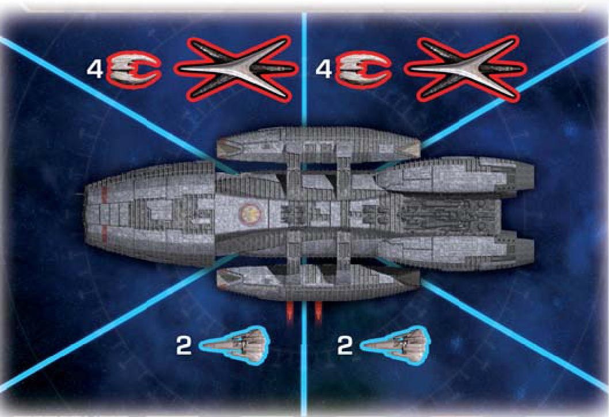

When Galactica returns, first place 1 basestar and 4 raiders in each of the 2 top space areas. Place 2 vipers in each of the 2 bottom space areas (4 total). 

The jump track will not be used for the rest of the game, so from now on ignore the "Prepare to Jump" icon on Crisis cards. Instead, resolve the "Evacuation" icon as follows:

- The current player takes a civilian ship from the top of the Prepared Civilian Ships space and moves it one of the two space areas with a viper launch icon. 
- If no ships are in the Prepared pile, nothing happens. Since the final jump is at the sole discretion of the Admiral, do not use the jump track. 

Human players may now move between New Caprica, Galactica, and the other human ships by discarding a Skill card. Colonial One is not accessible during the New Caprica phase even after Galactica comes back. Cylon players may also move between New Caprica and the other Cylon locations by discarding a Skill card. Ships and Centurions are once again affected by game effects as normal. 

Vipers may use their "escort civilian ships" activation on civilian ships in their space area.

#### Evacuating New Caprica

Once Galactica is in orbit, the Admiral has an action available on their title card which initiates the final jump and ends the game. 

When the final jump occurs:

- Destroy all civilian ships still on New Caprica. 
- [Execute all human players](#execution) on New Caprica. 
- After these steps are fully resolved, [resolve all other "end of game" effects as normal](#final-jump). 

### Ionian Nebula: Crossroads Phase

The Crossroads phase begins immediately upon reaching 8 or more distance, interrupting the current player's turn. The Cylons are lying in wait to ambush the human fleet, and each character faces an important decision. There are 3 steps to the Crossroads phase:

#### Battle of the Ionian Nebula

First, set up the Battle of the Ionian Nebula:

1. Place a basestar and 4 raiders in each of the top 2 main board space areas. 
2. Launch 2 vipers into each of the two bottom space areas. 
3. Finally, reset the jump track.

#### Crossroads

Second, each character will be put to the test with a Crossroads card:

1. The current player shuffles the Crossroads deck and deals each player 1 card.  
2. Each player secretly looks at theirs, and selects 1 Trauma token to play facedown next to their Crossroads card. The indicated icon is the result that will be resolved. 
    - A player with no Trauma tokens may select either result when the card is revealed. 
3. Once all players have made their selection, the current player reveals their card and token. The chosen result is resolved, and the next player reveals their choice. 
    - Resolve any executions normally when they occur, but the executed player's Crossroads card and token choice remain. 

#### The Trial/Boxing the Line

Third, characters will be judged by their peers:

1. Remove all Crossroads cards and the Trauma tokens used with them from the game. Also remove all Ally cards and tokens, the Trauma tokens attached to them, and the Trauma tokens on board locations from the game. 
2. Each player reveals all of their Trauma tokens. Human players discard their "Benevolent" tokens, while Cylon players discard all of their "Antagonistic" tokens.
3. Each player with 2 or fewer tokens at this point discards them. 
4. Each player counts the number of tokens they have remaining.
5. If all players have 0 tokens, then no player is eliminated. If not, the player with the most tokens is eliminated from the game. 
    - If human players are tied, the President chooses one of the tied players for elimination.
    - If Cylon players are tied, each tied Cylon player is eliminated.
    - If both human and Cylon players are tied, follow *both* rules. All tied Cylons are eliminated, and the President chooses which tied human is eliminated. 

After the Crossroads phase is finished, resume play at the point that the Crossroads phase interrupted. If the Crossroads phase was reached via a jump, since the jump track was already reset do not reset it again (even though technically that is the next step in the procedure). The next jump will [end the game](#final-jump). 

#### Elimination

To eliminate a player from the game, follow [the rules for execution](#execution), but stop when told to either choose a new character or move to the Resurrection Ship. Their character sheet and token is removed from the game, and they must discard any Super Crisis cards. The eliminated player no longer takes turns and is entirely removed from the game. If they were the current player, the next player is now the current player. Any former titles are given to the first in the [line of succession](#lines-of-succession). 

### Human loss

If the humans lose, the game immediately ends and the Cylon team has won. (Note that if the humans run out of a resource, they have until the end of the turn to replenish it before they have actually lost.) Players may reveal their "game has ended" Motive cards if all conditions are true to see if they have won along with the Cylons or not.Players with Agenda cards may now reveal them to see if they have won along with the Cylons.

### Final jump

All the endings are turned on, so you are probably playing some sort of "mega game" variant. Refer to those rules to resolve the end of the game. By the official rules, each ending has a "final jump" that either happens after a certain distance is reached, or for the New Caprica phase, happens when (and only when) the Admiral uses a special action available to them on their title card. The final jump simply ends the game, the [normal jump procedure](#jumping-the-fleet) is not followed, so there is no "Remove Ships" step or Destination card drawn. The potential population loss from "FTL Control" does still happen since that happens before the jump begins. 

After the final distance indicated on the Objective card is reached, the next time the fleet jumps will end the game. When this happens the [normal jump procedure](#jumping-the-fleet) is skipped, so there is no "Remove Ships" step and no Destination card is drawn. The "FTL Control" location does still trigger a population loss if the die roll is 6 or lower, since this happens before the jump. 

At the distance indicated on the New Caprica objective card, the New Caprica phase begins. Gameplay continues, with all players interacting on New Caprica. The jump track is used one last time to bring back Galactica, and after Galactica returns the final jump will end the game. 

The final jump can only be initiated by the Admiral as an action, not by using the jump track or "FTL control". The [normal jump procedure](#jumping-the-fleet) is skipped, so there is no "Remove Ships" step and no Destination card is drawn. Instead, follow [the rules listed above for ending the game in New Caprica](#evacuating-new-caprica). 

After the final jump, Cylon Leaders must wait until all other effects are resolved before they can reveal any "game is over" Motive cardsdeclare their Agenda fulfilled.

After the final jump, Sympathetic Cylons must wait until all other effects are resolved before they can reveal any "game is over" Motive cardsdeclare their Agenda fulfilled.

"Preventative Policy" cards remain in effect if they were played during the final turn.
 

When resolving any end of game effects, unrevealed Cylons continue to be treated as human players but they still ultimately win or lose with the Cylons. Infiltrators continue to be treated as human or Cylon players depending on whether or not they are Infiltrating. Resolve game effects that take place at the end of the game such as unfulfilled Personal Goal cards. Note, however, that Personal Goal cards do not apply at the end of the game if they are held by a <em>revealed</em> Cylon. 

If the humans have not run out of resources or lost by any other means when everything is resolved at the end of the game, the humans win!
